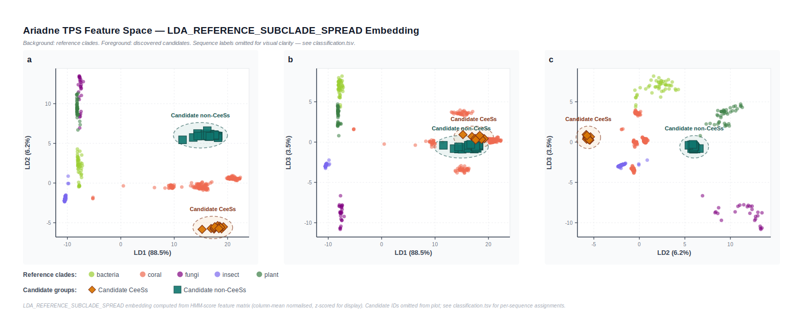
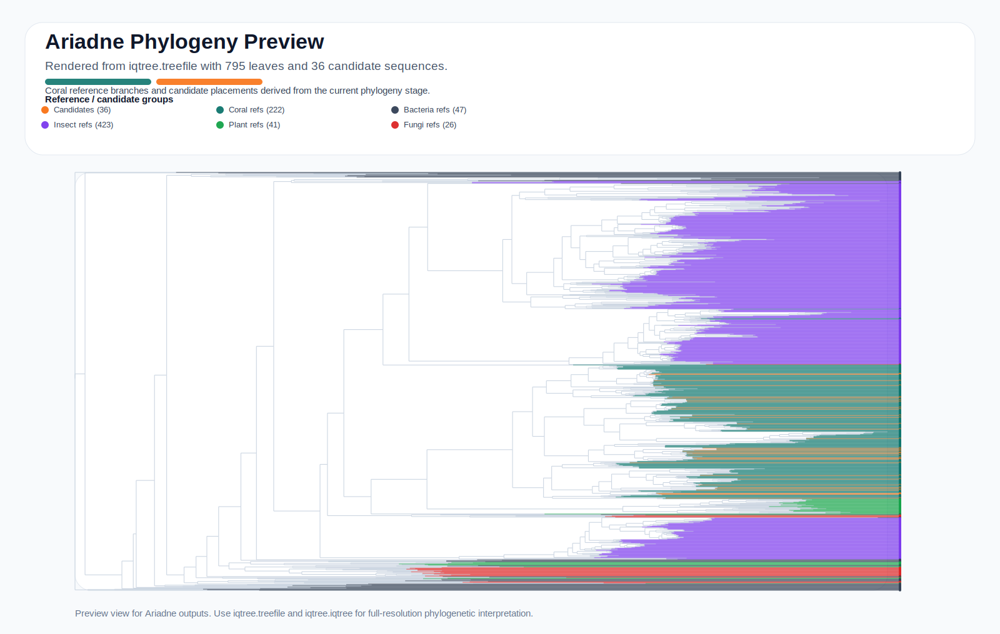

<p align="center">
  
</p>

<p align="center">
  <a href="./README_ZH.md"><strong>中文</strong></a>
</p>

<p align="center">
  🧬 <strong>Ariadne</strong><br>
  A coral-centered terpene synthase discovery and CeeSs prioritization platform
</p>

<p align="center">
  
  
  
  
  
  
  <a href="./docs/index.md"></a>
</p>

<p align="center">
  <a href="./docs/index.md">
    
  </a>
</p>

> Ariadne is a research-oriented platform for coral TPS genome mining, CeeSs prioritization, and downstream phylogenetic analysis.  
> The current release uses a streamlined `discovery -> filtering -> classification -> phylogeny` workflow with `tree/` as the default reference source.

## 🪸 Introduction

The rational discovery of terpene synthases by genome mining is a promising route toward new natural-product scaffolds from microorganisms and other biological resources. In practice, however, discovering a novel TPS gene is much easier than identifying the synthase responsible for a specific end product, which is why biochemical validation remains essential.

Cnidarians are marine animals that produce diverse terpenoids as defensive metabolites, making coral genomes an attractive resource for TPS discovery. Ariadne was built around this opportunity: it supports both genome-wide TPS mining from corals and the targeted prioritization of product-specific synthases, here formalized as <strong>CeeSs</strong>.

The platform is designed to bridge computational screening and experimental follow-up. In the associated study context, Ariadne was used to recover CeeSs candidates, support heterologous-expression validation with an accuracy of 80%, and guide phylogenetic analysis toward the evolutionary interpretation of distinct CeeSs and ancestral scaffold discovery.

## 📢 News

- `2026-03-23`: The repository introduction was updated around the new `CeeSs` framing for coral TPS mining and CeeSs prioritization.
- `2026-03-21`: GitHub landing page switched to English by default, with a dedicated Chinese documentation page at [README_ZH.md](./README_ZH.md).
- `2026-03-21`: The pipeline was simplified to a cleaner four-stage workflow. All `motif` and `benchmark` functionality was removed.
- `2026-03-21`: `tree/` is now the default source for query-HMM construction, TPS HMM library generation, classification background, and phylogeny references.

## ✨ Highlights

- 🌊 Tree-native workflow: one curated `tree/` directory drives discovery, classification, and phylogeny.
- 🧭 Feature-space screening: candidates are projected into a TPS HMM embedding for nearest-reference assignment and visual inspection.
- 🤖 CeeSs-aware classification: after coral-like assignment, Ariadne can use `TPS/TPS.xlsx` plus ESM2 to further score `cembrene A / cembrene B` candidates.
- 🌳 Phylogeny-ready by default: after classification, Ariadne directly builds a MAFFT alignment and IQ-TREE phylogeny.
- 🧪 Practical CLI design: full end-to-end `run`, plus modular `discover`, `filter`, `classify`, and `phylogeny` commands.
- 📄 Figure-friendly outputs: the pipeline exports `embedding.svg`, `embedding_3d_sections.svg`, local context trees, and final Newick trees.

## 🖼️ Results Preview

<p align="center">
  
</p>

<p align="center">
  
</p>

<p align="center">
  
</p>

<p align="center">
  Latest preview synced from <code>tmp_run_default_ceess/03_classification/</code> and <code>tmp_run_default_ceess/04_phylogeny/</code>, showing the default pipeline with explicit <code>Candidate CeeSs</code> versus <code>Candidate non-CeeSs</code> separation in embedding space and the real downstream IQ-TREE phylogeny.
</p>

## 🧠 Overview

The current Ariadne workflow is intentionally compact:

1. `discovery`
   Build a query HMM from the reference FASTA files in `tree/`, then search protein FASTA files or transcriptome-derived ORFs for candidate TPS sequences.
2. `filtering`
   Remove low-coverage, too-short, and near-duplicate candidates.
3. `classification`
   Score all references and candidates against a TPS HMM library, embed them in feature space, and assign each candidate to its nearest reference source.
4. `phylogeny`
   Merge filtered candidates with the reference collection, run MAFFT, and reconstruct a phylogeny with IQ-TREE.

## 🗂️ Repository Layout

```text
Ariadne/
├── ariadne/                # core package, including bundled HMMs under ariadne/hmm/
├── input/                  # example protein inputs
├── TPS/                    # labeled coral TPS spreadsheet for ESM type analysis
├── tree/                   # default reference FASTA collection
├── output/                 # historical example outputs, kept only for reference
├── fig/                    # logos and figures
├── environment.yml         # conda environment
├── install.sh
└── pyproject.toml
```

## 📁 Data Convention

- `input/`
  Example input folder for candidate mining. This is the standard source for `--protein-folder`.
- `TPS/`
  Optional supervised-analysis folder. `TPS/TPS.xlsx` stores curated coral TPS proteins, with the protein sequence in the second column and the product `Type` label in the third column. When present, `classification` can use it to train an ESM-based CeeSs head.
- `tree/`
  The primary reference directory. Ariadne reads all multi-clade TPS FASTA files here and uses them to build the query HMM, TPS HMM library, classification background, and phylogeny background.
- `ariadne/hmm/`
  Bundled default HMM resources generated from the current `tree/` dataset. Ariadne now prefers `ariadne/hmm/query.hmm` for discovery and `ariadne/hmm/*.hmm` as the default TPS HMM library.
- `output/`
  A legacy example-output folder. It is no longer part of the default pipeline logic.

## 🛠️ Installation

### Conda

```bash
git clone https://github.com/zhaoruijiang26/Ariadne.git
cd Ariadne
conda env create -f environment.yml
conda activate ariadne
pip install -e .
```

### Optional ESM dependencies

If you want Ariadne to score coral-like candidates for `cembrene A / cembrene B` during `classification`, install the optional ESM stack:

```bash
pip install -e '.[esm]'
```

This adds `torch` and `transformers` for ESM2 embedding inference.

### ESM model presets

By default, Ariadne now uses the larger ESM2 checkpoint:

```text
facebook/esm2_t33_650M_UR50D
```

For convenience, the CLI also accepts short presets:

| Preset | Resolved model |
| --- | --- |
| `150M` | `facebook/esm2_t30_150M_UR50D` |
| `650M` | `facebook/esm2_t33_650M_UR50D` |
| `3B` | `facebook/esm2_t36_3B_UR50D` |
| `15B` | `facebook/esm2_t48_15B_UR50D` |

If you prefer the user-facing shorthand `504M`, Ariadne accepts it and maps it to the default large checkpoint internally.

Example:

```bash
ariadne classify \
  --candidates results/02_filtering/candidates.filtered.faa \
  --reference-dir tree/ \
  --output-dir results_classification/ \
  --ceess-model-name 150M
```

### venv

```bash
git clone https://github.com/zhaoruijiang26/Ariadne.git
cd Ariadne
bash install.sh
```

### Manual

```bash
git clone https://github.com/zhaoruijiang26/Ariadne.git
cd Ariadne
python -m venv .venv
source .venv/bin/activate
python -m pip install -U pip
python -m pip install -e .
```

## 📦 Dependencies

- Python `>= 3.9`
- `mafft`
- `iqtree` or `iqtree2`
- `numpy >= 1.24`
- `openpyxl >= 3.1`
- `pyhmmer >= 0.12.0`
- `pyrodigal >= 3.7.0`
- `scikit-learn >= 1.4`

Recommended environment: Python `3.11` via [environment.yml](./environment.yml).

## 🚀 Quick Start

### End-to-end run

```bash
ariadne run \
  --protein-folder input/ \
  --reference-dir tree/ \
  --output-dir results/
```

This command will automatically:

- use the bundled discovery query HMM from `ariadne/hmm/query.hmm`
- use the bundled TPS HMM library from `ariadne/hmm/*.hmm`
- discover candidate proteins
- filter and deduplicate candidates
- classify them in TPS feature space
- generate the final alignment and phylogeny

### Transcriptome mode

```bash
ariadne run \
  --transcriptomes sample1.fasta sample2.fasta \
  --reference-dir tree/ \
  --output-dir results_from_transcriptomes/
```

### Classification only

```bash
ariadne classify \
  --candidates results/02_filtering/candidates.filtered.faa \
  --reference-dir tree/ \
  --output-dir results_classification/
```

### Alignment and phylogeny only

```bash
ariadne phylogeny \
  --candidates results/02_filtering/candidates.filtered.faa \
  --reference-dir tree/ \
  --output-dir results_phylogeny/
```

### Coral-like candidate scoring for CeeSs

```bash
ariadne classify \
  --candidates results/02_filtering/candidates.filtered.faa \
  --reference-dir tree/ \
  --output-dir results_classification/
```

If `TPS/TPS.xlsx` is available and the optional ESM dependencies are installed, `classification` will automatically:

- gate candidates that are `coral-like`
- train a small ESM-based type classifier from `TPS/TPS.xlsx`
- score those coral-like candidates for `cembrene A / cembrene B`
- export a prioritized CeeSs candidate list

Key outputs are:

- `classification.tsv`
- `ceess_predictions.tsv`
- `ceess_candidates.tsv`
- `ceess_candidates.fasta`
- `ceess_embedding.svg`
- `ceess_model_metrics.tsv`

You can still run the supervised spreadsheet analysis alone with:

```bash
ariadne esm-type \
  --xlsx TPS/TPS.xlsx \
  --output-dir esm_results/
```

That command focuses only on the labeled coral TPS table and exports:

- `esm_embedding.svg`
- `esm_projection.tsv`
- `esm_predictions.tsv`
- `esm_confusion_matrix.tsv`
- `esm_metrics.tsv`

On the current bundled spreadsheet, the ESM baseline contains `50` proteins across `5` product types and reaches a cross-validated accuracy of `0.74`.

## 🎓 Tutorial

### Tutorial 1. Run the repository example

Use the included `input/` and `tree/` folders:

```bash
.venv/bin/python -m ariadne run \
  --protein-folder input \
  --reference-dir tree \
  --output-dir tmp_run_example
```

Expected outputs:

- `tmp_run_example/01_discovery/`
- `tmp_run_example/02_filtering/`
- `tmp_run_example/03_classification/`
- `tmp_run_example/04_phylogeny/`
- `tmp_run_example/pipeline_summary.tsv`

### Tutorial 2. Inspect classification outputs

Start with:

- `03_classification/classification.tsv`
- `03_classification/nearest_neighbors.tsv`
- `03_classification/embedding.svg`
- `03_classification/embedding_3d_sections.svg`

These files tell you which reference source each candidate is closest to, how confident that assignment is, and where the candidate lies in TPS feature space.

### Tutorial 3. Inspect phylogeny outputs

Start with:

- `04_phylogeny/phylogeny_input.fasta`
- `04_phylogeny/phylogeny_alignment.fasta`
- `04_phylogeny/phylogeny_preview.svg`
- `04_phylogeny/iqtree.treefile`
- `04_phylogeny/iqtree.iqtree`

### Tutorial 4. Read the integrated CeeSs outputs after classification

After `ariadne classify`, inspect:

- `classification.tsv`
- `ceess_predictions.tsv`
- `ceess_candidates.tsv`
- `ceess_candidates.fasta`
- `ceess_embedding.svg`

In a real validation run on the bundled example candidates, Ariadne first identified `36` coral-like sequences and then retained `12` high-confidence CeeSs candidates at `--ceess-threshold 0.5`.

### Tutorial 5. Run the standalone ESM type model on curated coral TPS proteins

```bash
.venv/bin/python -m ariadne esm-type \
  --xlsx TPS/TPS.xlsx \
  --output-dir tmp_esm_results
```

Recommended files to inspect first:

- `tmp_esm_results/esm_embedding.svg`
- `tmp_esm_results/esm_metrics.tsv`
- `tmp_esm_results/esm_confusion_matrix.tsv`
- `tmp_esm_results/esm_predictions.tsv`

This route is designed for supervised separation of known coral TPS product classes rather than de novo candidate discovery. It is therefore complementary to the main four-stage pipeline, not a replacement for it.

These files give you the exact alignment and tree used for downstream interpretation, figure generation, or manual curation.

## 🧪 CLI Reference

### Main commands

| Command | Purpose |
| --- | --- |
| `ariadne run` | full end-to-end workflow |
| `ariadne discover` | HMM-based candidate discovery from proteins or transcriptomes |
| `ariadne filter` | coverage, length, and near-duplicate filtering |
| `ariadne classify` | TPS feature-space classification |
| `ariadne phylogeny` | MAFFT alignment plus IQ-TREE reconstruction |
| `ariadne build-hmm` | build a single query HMM from a FASTA/MSA source |
| `ariadne build-tps-hmm-library` | build a TPS HMM library directory from reference FASTA/MSA files |

### `ariadne run`

| Parameter | Default | Description |
| --- | --- | --- |
| `--protein-folder` | `None` | folder of protein FASTA files |
| `--transcriptomes` | `None` | transcriptome FASTA files for ORF prediction mode |
| `--reference-dir` | required | tree-native reference directory |
| `--output-dir` | required | output root |
| `--query-hmm` | bundled `ariadne/hmm/query.hmm` | use a prebuilt discovery HMM instead of fallback auto-building from `tree/` |
| `--tps-hmm-dir` | bundled `ariadne/hmm/` | use a prebuilt TPS HMM library instead of fallback auto-building from `tree/` |
| `--min-coverage` | `10.0` | filtering coverage threshold |
| `--min-length` | `300` | filtering minimum amino-acid length |
| `--identity-threshold` | `0.95` | near-duplicate collapse threshold |
| `--top-k` | `5` | nearest-reference voting size |
| `--tree-neighbors` | `12` | reference neighbors per local context tree |
| `--skip-phylogeny` | `False` | skip MAFFT + IQ-TREE |
| `--mafft-mode` | `--auto` | MAFFT mode |
| `--iqtree-model` | `LG` | IQ-TREE model |
| `--iqtree-threads` | `AUTO` | IQ-TREE threads |
| `--iqtree-bootstrap` | `None` | optional ultrafast bootstrap replicates |
| `--no-iqtree-fast` | `False` | disable default `--fast` mode |

### `ariadne discover`

| Parameter | Default | Description |
| --- | --- | --- |
| `--protein-folder` | `None` | folder of predicted protein FASTA files |
| `--transcriptomes` | `None` | transcript FASTA inputs |
| `--protein-glob` | common FASTA patterns | file globs under `--protein-folder` |
| `--hmm` | required | discovery HMM |
| `--output-dir` | required | discovery output directory |
| `--min-score` | `None` | optional minimum HMM score |
| `--max-evalue` | `None` | optional maximum E-value |

### `ariadne filter`

| Parameter | Default | Description |
| --- | --- | --- |
| `--input-fasta` | required | candidate protein FASTA |
| `--output-dir` | required | filter output directory |
| `--min-coverage` | `10.0` | remove low-coverage records |
| `--min-length` | `300` | remove short proteins |
| `--identity-threshold` | `0.95` | near-duplicate threshold |

### `ariadne classify`

| Parameter | Default | Description |
| --- | --- | --- |
| `--candidates` | required | filtered candidate FASTA |
| `--reference-dir` | required | reference FASTA directory |
| `--output-dir` | required | classification output directory |
| `--tps-hmm-dir` | bundled `ariadne/hmm/` | TPS HMM library directory |
| `--top-k` | `5` | nearest-reference voting size |
| `--tree-neighbors` | `12` | neighbors used for local context trees |

### `ariadne phylogeny`

| Parameter | Default | Description |
| --- | --- | --- |
| `--candidates` | required | filtered candidate FASTA |
| `--reference-dir` | required | reference FASTA directory |
| `--output-dir` | required | phylogeny output directory |
| `--mafft-bin` | auto | explicit MAFFT binary |
| `--mafft-mode` | `--auto` | MAFFT mode |
| `--iqtree-bin` | auto | explicit IQ-TREE binary |
| `--iqtree-model` | `LG` | substitution model |
| `--iqtree-threads` | `AUTO` | thread setting |
| `--iqtree-bootstrap` | `None` | optional bootstrap |
| `--no-iqtree-fast` | `False` | disable default fast mode |

## 📤 Output Structure

```text
results/
├── 01_discovery/
│   ├── candidates.protein.faa
│   ├── candidates.orf.fna
│   └── candidates.hits.tsv
├── 02_filtering/
│   ├── candidates.filtered.faa
│   ├── filter_report.tsv
│   ├── dedupe_clusters.tsv
│   └── manual_review.tsv
├── 03_classification/
│   ├── tps_features.tsv
│   ├── embedding.tsv
│   ├── embedding.svg
│   ├── embedding_3d_sections.svg
│   ├── classification.tsv
│   ├── nearest_neighbors.tsv
│   ├── candidate_cluster_context.tsv
│   ├── global_context_tree.nwk
│   └── trees/
├── 04_phylogeny/
│   ├── phylogeny_input.fasta
│   ├── phylogeny_alignment.fasta
│   ├── phylogeny_preview.svg
│   ├── phylogeny_sequence_map.tsv
│   ├── iqtree.treefile
│   └── iqtree.iqtree
└── pipeline_summary.tsv
```

## 🔬 Recommended Reading Order for Results

1. Open `pipeline_summary.tsv` to verify all stages completed.
2. Read `03_classification/classification.tsv` for per-candidate assignments.
3. Inspect `03_classification/embedding.svg` for global candidate placement.
4. Start with `04_phylogeny/phylogeny_preview.svg`, then read `04_phylogeny/iqtree.treefile` and `04_phylogeny/iqtree.iqtree` for full phylogenetic interpretation.

## ⚠️ Notes

- `tree/` is now the canonical source of reference FASTA files.
- `Alignment.fasta`-based entrypoints are no longer part of the main workflow.
- `motif` and `benchmark` functionality were intentionally removed to keep the current release focused and stable.
- The repository still contains historical example outputs under `output/`, but they are not required for the current pipeline.

## 📚 Citation

If Ariadne is useful in your work, please cite the software entry below and update it with your preferred version tag or DOI when available.

```bibtex
@software{jiang2026ariadne,
  author       = {Jiang, Zhaorui},
  title        = {Ariadne: A Tree-Native Terpene Synthase Discovery and Phylogeny Platform},
  year         = {2026},
  url          = {https://github.com/zhaoruijiang26/Ariadne},
  version      = {0.1.0}
}
```

## 🤝 Acknowledgement

Ariadne is designed as a practical bridge between TPS candidate mining and downstream phylogenetic interpretation, especially for coral-centered discovery settings where curated cross-clade references matter.
