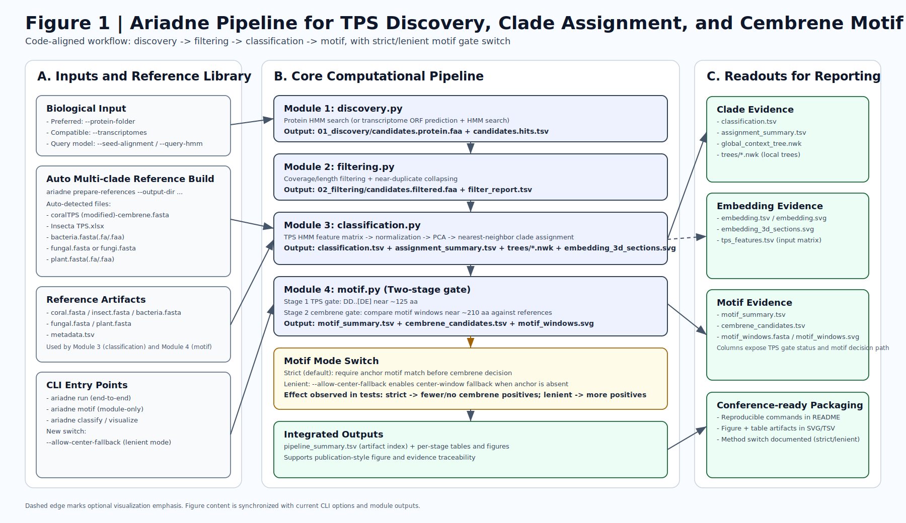

# Ariadne

Ariadne 是一个面向 TPS（terpene synthase）发现与注释的蛋白优先（protein-first）分析管线，核心流程为：

`discover -> filter -> classify -> motif`

可视化模块 `visualize` 作为下游独立步骤使用。

---

## Ariadne 当前文件夹解析（基于当前仓库代码）

```text
Ariadne/
├─ README.md
├─ pyproject.toml                  # 包配置，入口命令 ariadne=ariadne.cli:main
├─ Alignment.fasta                 # 示例/参考对齐文件（模块4可直接使用）
├─ xx.fasta                        # 仓库内样例输入
├─ install.sh                      # 一键安装脚本
├─ fig/
│  ├─ logo.png
│  ├─ ariadne_pipeline.svg         # 旧版流程图
│  ├─ ariadne_pipeline.png
│  └─ ariadne_framework_nature.svg # 新生成：Nature风格结构框架图
└─ ariadne/
   ├─ cli.py                       # 所有子命令与 run 编排入口
   ├─ discovery.py                 # HMM构建 + 候选发现
   ├─ filtering.py                 # 覆盖度/长度过滤 + 去冗余
   ├─ classification.py            # HMM特征空间分类 + 邻居树
   ├─ motif.py                     # DDXXD/E与cembrene-like窗口判断
   ├─ visualization.py             # t-SNE/聚类可视化
   ├─ references.py                # 参考库准备与加载
   ├─ fasta_utils.py               # FASTA/TSV读写与通用工具
   ├─ demo.py                      # 演示工作区生成
   ├─ filter_coverage.py           # 兼容脚本
   ├─ filter_contigs.py            # 兼容脚本
   ├─ filter_contigs_long.py       # 兼容脚本
   ├─ DupRemover.py                # 兼容脚本
   └─ tps_hmm/*.hmm                # 内置TPS HMM（遗留占位，不建议用于最终结论）
```

### 核心模块职责（代码对齐版）

| 模块                | 主要功能                                               | 关键输出                                                |
| ------------------- | ------------------------------------------------------ | ------------------------------------------------------- |
| `discovery.py`      | 从蛋白或转录组中发现 TPS 候选（HMM 搜索）              | `candidates.protein.faa`, `candidates.hits.tsv`         |
| `filtering.py`      | 覆盖度/长度过滤 + 近似重复序列去冗余                   | `candidates.filtered.faa`, `filter_report.tsv`          |
| `classification.py` | 候选与参考序列统一打分、降维、近邻分类、局部树         | `tps_features.tsv`, `classification.tsv`, `trees/*.nwk` |
| `motif.py`          | 先做 TPS 模体闸门，再做 cembrene-like 窗口匹配判断     | `motif_summary.tsv`, `cembrene_candidates.tsv`          |
| `visualization.py`  | 对 `tps_features.tsv`（或 legacy 表）做 t-SNE + DBSCAN | `tsne-db*.tsv`, `tsne*.svg`                             |

---

## 结构框架图



**图注（Figure 1）**：该图按当前实现重建了 Ariadne 的输入层、四段核心管线、可视化分支与最终输出层；图中模块名、参数入口与产物文件名均与 `ariadne/cli.py`、`discovery.py`、`filtering.py`、`classification.py`、`motif.py`、`visualization.py` 保持一致。

---

## 关键声明：内置 HMM 的来源

`ariadne/tps_hmm/*.hmm` 为历史遗留（AFLP 来源）占位 profile，不是严格策展的高置信 TPS HMM 库。

用于论文级结论或最终筛选时，请通过 `--tps-hmm-dir` 提供你自己的 TPS HMM 库。

---

## 当前软件能力

- 支持蛋白优先模式：`--protein-folder`（推荐）
- 兼容转录组模式：`--transcriptomes`
- 模块 4（`motif`）逻辑：
  - 先确认 TPS 特征模体：`DD..[DE]`（约 125 aa 附近）
  - 再评估 210 aa 附近窗口是否偏向 cembrene-like
  - 默认会优先寻找 `./Alignment.fasta` 作为模块 4 的参考对齐
- 可视化模块已内置：`ariadne visualize`
  - 支持 `tps_features.tsv`（Ariadne classify 输出）
  - 也支持 legacy `hmm_tab.txt` 风格输入

---

## 安装

要求：

- Python `>=3.9`

### 方式 1：脚本安装

```bash
bash install.sh
ariadne --help
```

### 方式 2：手动安装

```bash
python3 -m venv .venv
source .venv/bin/activate
python -m pip install -e .
```

---

## 推荐科研工作流

### 1) 构建你自己的 TPS HMM 库（推荐）

```bash
ariadne build-tps-hmm-library \
  --alignment cladeA=/path/to/cladeA_alignment.fasta \
  --alignment cladeB=/path/to/cladeB_alignment.fasta \
  --output-dir /path/to/real_tps_hmm
```

如果只有一个对齐文件，也可以：

```bash
ariadne build-tps-hmm-library \
  --alignment tps_core=Alignment.fasta \
  --output-dir ./tps_hmm_real
```

### 2) 用真实 TPS HMM 库运行完整管线

```bash
ariadne run \
  --protein-folder /path/to/protein_folder \
  --seed-alignment /path/to/seed_alignment.fasta \
  --reference-dir /path/to/references \
  --reference-alignment /path/to/Alignment.fasta \
  --tps-hmm-dir /path/to/real_tps_hmm \
  --output-dir /path/to/run_output
```

关键参数：

- `--tps-hmm-dir`：你自己的 TPS HMM 库目录
- `--reference-alignment`：模块 4 的参考对齐
- `--min-length`、`--min-coverage`、`--identity-threshold`：过滤严格度

---

## 第 3 步：多类群来源判定（树 + 3D 切面）

你提出的“与 bacteria/fungal/plant + insect + coral 做类群判定”这一步，现在可以按下面流程直接执行。

### A) 先构建多来源参考库

推荐（自动识别当前目录中的标准文件名）：

```bash
ariadne prepare-references \
  --output-dir /private/tmp/ariadne_refs_auto_20260313
```

自动识别规则（存在则加载）：
- `coralTPS (modified)-cembrene.fasta`
- `Insecta TPS.xlsx`
- `bacteria.fasta`（也支持 `.fa/.faa`）
- `fungal.fasta` 或 `fungi.fasta`（也支持 `.fa/.faa`）
- `plant.fasta`（也支持 `.fa/.faa`）

如需手动指定路径：

```bash
ariadne prepare-references \
  --coral "./coralTPS (modified)-cembrene.fasta" \
  --insect-xlsx "./Insecta TPS.xlsx" \
  --bacteria-fasta "./bacteria.fasta" \
  --fungi-fasta "./fungi.fasta" \
  --plant-fasta "./plant.fasta" \
  --output-dir /tmp/ariadne_refs_all
```

说明：
- `--bacteria-fasta/--fungal-fasta/--plant-fasta` 是可选参数。
- `--fungi-fasta` 是 `--fungal-fasta` 的别名。
- 如果某个文件不存在，CLI 会给出 warning 并跳过该类群，不会中断。

### B) 用多类群参考库运行 pipeline

```bash
ariadne run \
  --protein-folder ./protein \
  --seed-alignment ./Alignment.fasta \
  --reference-dir /tmp/ariadne_refs_all \
  --reference-alignment "./coralTPS (modified)-cembrene.fasta" \
  --tps-hmm-dir /tmp/ariadne_real_hmm \
  --output-dir /tmp/ariadne_multiclade_run
```

### C) 重点看这些输出（判断是否动物来源 TPS）

- `03_classification/classification.tsv`
  - 每条候选的 `predicted_source`（例如 bacteria/fungal/plant/insect/coral）。
- `03_classification/assignment_summary.tsv`
  - 按类群汇总的数量与平均置信度。
- `03_classification/global_context_tree.nwk`
  - 全局树（参考序列 + 候选序列）。
- `03_classification/trees/*.nwk`
  - 每条候选的局部邻域树。
- `03_classification/embedding_3d_sections.svg`
  - 3D PCA 切面图（PC1-PC2、PC1-PC3、PC2-PC3），可视化候选落在哪个类群区域。

### D) 2026-03-13 最新实测（已包含 bacteria/fungal(or fungi)/plant）

- 参考库：`/private/tmp/ariadne_refs_auto_20260313`
  - 共 `774` 条参考序列  
  - `insect=420`, `coral=240`, `bacteria=47`, `plant=41`, `fungal=26`
- 运行目录：`/private/tmp/ariadne_multiclade_run_auto_20260313/run_output`
- 分类结果：
  - `03_classification/classification.tsv`：36 条候选（文件 37 行含表头）
  - `03_classification/assignment_summary.tsv`：`coral=36`，平均置信度 `1.0`
- 模体结果：
  - `04_motif/motif_summary.tsv`：36 条候选（文件 37 行含表头）
  - `04_motif/cembrene_candidates.tsv`：8 行（含表头）

---

## 仓库内真实样例测试（当前文件）

本仓库可直接复现的输入：

- `Alignment.fasta`
- `xx.fasta`

### 使用命令

```bash
source .venv/bin/activate

REAL=/tmp/ariadne_real_sample
rm -rf "$REAL"
mkdir -p "$REAL/proteins" "$REAL/references"

cp xx.fasta "$REAL/proteins/xx.faa"
cp Alignment.fasta "$REAL/references/coral.fasta"

ariadne build-tps-hmm-library \
  --alignment tps_core=Alignment.fasta \
  --output-dir "$REAL/tps_hmm_real"

ariadne run \
  --protein-folder "$REAL/proteins" \
  --seed-alignment Alignment.fasta \
  --reference-dir "$REAL/references" \
  --reference-alignment Alignment.fasta \
  --tps-hmm-dir "$REAL/tps_hmm_real" \
  --output-dir "$REAL/run_output"
```

### 已观察到的输出（真实运行）

- `01_discovery/candidates.hits.tsv`: `236` 行
- `02_filtering/filter_report.tsv`: `236` 行
- `03_classification/classification.tsv`: `160` 行
- `04_motif/motif_summary.tsv`: `160` 行

示例输出文件：

- `/tmp/ariadne_real_sample/run_output/pipeline_summary.tsv`
- `/tmp/ariadne_real_sample/run_output/03_classification/tps_features.tsv`
- `/tmp/ariadne_real_sample/run_output/04_motif/motif_summary.tsv`

---

## 可视化模块（`ariadne visualize`）

### A) 可视化 Ariadne 的 `tps_features.tsv`（推荐）

```bash
ariadne visualize \
  --input-table /tmp/ariadne_real_sample/run_output/03_classification/tps_features.tsv \
  --output-dir /tmp/ariadne_real_sample/visualization
```

会生成：

- `tsne-db<perplexity>.tsv`
- `tsne<perplexity>.svg`
- `visualization_summary.tsv`

### B) 可视化 legacy `hmm_tab` 风格输入

```bash
ariadne visualize \
  --input-table /path/to/hmm_tab.txt \
  --output-dir /path/to/visualization
```

可选参数：

- `--perplexities 25 38`
- `--min-points 20`

---

## 运行后关键目录（`ariadne run`）

```text
run_output/
├─ 01_discovery/
├─ 02_filtering/
├─ 03_classification/
├─ 04_motif/
└─ pipeline_summary.tsv
```

---

## `run_output` 内容解析

以下解析对应本次测试输出目录：`/tmp/ariadne_tps_debug_20260313/run_output`。

### 1) 总索引文件

- `pipeline_summary.tsv`
  - 作用：把每个模块产出的文件路径集中登记（stage/artifact/path 三列）。
  - 用法：先看它，快速定位每个阶段文件，不用手工找路径。

### 2) `01_discovery/`（候选发现）

- 关键文件：
  - `candidates.protein.faa`：HMM 命中的候选蛋白序列。
  - `candidates.hits.tsv`：每条命中的 HMM 评分明细（score/evalue/env_from/env_to）。
  - `query.hmm`：由 `--seed-alignment` 构建的查询 HMM。
- 本次统计：
  - `candidates.protein.faa`：100 条候选序列。
  - `candidates.hits.tsv`：101 行（1 行表头 + 100 行命中）。

### 3) `02_filtering/`（过滤与去冗余）

- 关键文件：
  - `filter_report.tsv`：每条候选是 `kept` 还是 `removed`，以及原因（`low_coverage`、`too_short`、`deduplicated_against:*`）。
  - `candidates.filtered.faa`：最终保留序列（进入 classify/motif）。
  - `dedupe_clusters.tsv`：去冗余聚类关系（代表序列与成员）。
  - `manual_review.tsv`：人工复核辅助（起始是否 M、anchor 是否存在等）。
- 本次统计：
  - `kept=36`，`removed=64`。
  - `candidates.filtered.faa`：36 条序列。

### 4) `03_classification/`（特征空间分类）

- 关键文件：
  - `classification.tsv`：每条候选的预测来源、最近参考序列、距离、置信度。
  - `assignment_summary.tsv`：按预测类群聚合后的数量与平均置信度。
  - `tps_features.tsv`：用于降维/可视化的原始特征矩阵。
  - `embedding.tsv`、`embedding.svg`：二维/三维嵌入坐标与图。
  - `embedding_3d_sections.svg`：三视角 3D 切面图（PC1-PC2/PC1-PC3/PC2-PC3）。
  - `global_context_tree.nwk`：全局 UPGMA 树（参考 + 候选）。
  - `nearest_neighbors.tsv`：每条候选的 Top-K 近邻明细。
  - `trees/*.nwk`：每个候选对应的局部 UPGMA 树。
- 本次统计：
  - `classification.tsv`：36 条候选。
  - `trees/`：36 个 `.nwk`（每条候选一个局部树）。
  - `tps_features.tsv`：92 行数据（= 参考序列 + 36 条候选），因此会大于 `classification.tsv`。
  - 预测来源全为 `coral`，平均置信度 `1.0000`（针对本次参考集）。

### 5) `04_motif/`（TPS/cembrene 模体判断）

- 关键文件：
  - `motif_summary.tsv`：每条序列是否为 TPS（`is_tps`）、是否命中 anchor、cembrene-like 判定。
  - `motif_windows.fasta`、`motif_windows.svg`：模体窗口序列与可视化。
  - `cembrene_candidates.tsv`：`predicted_cembrene_like=yes` 的子集。
- 本次统计：
  - `motif_summary.tsv`：36 条候选。
  - `is_tps=yes`：32 条；`is_tps=no`：4 条。
  - `cembrene_candidates.tsv`：空文件（0 行），表示本次没有 `predicted_cembrene_like=yes`。

### 6) 快速排错建议

- `candidates.hits.tsv` 很小或为空：优先检查 `--seed-alignment` 质量和输入蛋白文件格式。
- `filter_report.tsv` 大量 `low_coverage`：考虑降低 `--min-coverage`。
- `filter_report.tsv` 大量 `too_short`：考虑降低 `--min-length`。
- `cembrene_candidates.tsv` 为空：不一定是报错，表示当前数据在模块 4 条件下未命中 cembrene-like。

---

## 当前可用命令

```bash
ariadne --help
```

主子命令：

- `prepare-references`
- `prepare-demo`
- `build-hmm`
- `build-tps-hmm-library`
- `discover`
- `filter`
- `classify`
- `motif`
- `run`
- `visualize`
- `filter-coverage-only`
- `filter-length-only`
- `dedupe-exact`
