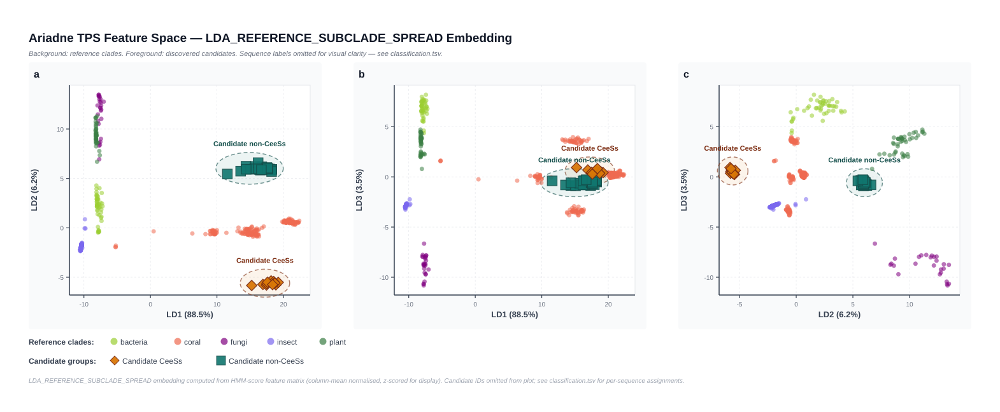

<p align="center">
  
</p>

<h1 align="center">Ariadne</h1>

<p align="center">
  <strong>A tree-native platform for coral terpene synthase discovery<br>and cembrene-class synthase (CeeSs) prioritization</strong>
</p>

<p align="center">
  <a href="./README_ZH.md">中文</a> &nbsp;·&nbsp;
  <a href="./docs/index.md">Documentation</a> &nbsp;·&nbsp;
  <a href="#quick-start">Quick Start</a> &nbsp;·&nbsp;
  <a href="#citation">Citation</a>
</p>

<p align="center">
  
  
  
  
  
  <a href="./docs/index.md"></a>
</p>

---

## Abstract

Terpene synthases (TPSs) generate the largest and most structurally diverse family of natural products, yet assigning a specific TPS gene to the metabolite it produces remains substantially harder than discovering new TPS genes. This product-assignment problem is acute in corals (Cnidaria), whose genomes encode hundreds of candidate TPSs but whose cembrene-type diterpenoids — central to coral chemical ecology — have few experimentally characterized synthases.

**Ariadne** is a tree-native, four-stage platform for coral TPS mining and the prioritization of **cembrene-class synthases (CeeSs)**. Starting from transcriptomes or predicted proteomes, it performs profile-HMM-guided discovery, coverage- and length-aware filtering, classification in a TPS profile-HMM feature space with supervised dimensionality reduction, and an optional ESM2-based scoring layer that ranks coral-like candidates by their cembrene probability `P(CeeSs)`. A single curated reference directory (`tree/`) anchors every stage, so candidate discovery, feature-space interpretation, and the final maximum-likelihood phylogeny share one consistent biological frame of reference.

## Contributions

- **One reference backbone, four stages.** A single `tree/` directory drives discovery, classification, and phylogeny, eliminating the bookkeeping and biological drift that arise when each stage uses a different reference set.
- **An interpretable feature space.** Candidates are scored against a multi-clade TPS profile-HMM library, embedded by supervised LDA (PCA fallback), and assigned reference labels by *k*-nearest-neighbor voting — producing geometry, neighbors, and labels rather than an opaque score.
- **CeeSs scoring with protein language models.** When labeled data (`TPS/TPS.xlsx`) and the optional ESM stack are available, a frozen ESM2 backbone with a lightweight trainable head (MLP, logistic regression, or a Barlow Twins contrastive variant) ranks each coral-like candidate for cembrene A / B.
- **Reproducible, auditable outputs.** Each run emits SVG embedding and tree figures, a MAFFT alignment, an IQ-TREE phylogeny, and a complete TSV audit trail from raw input to final shortlist.

## Method

<p align="center">
  
</p>

Ariadne runs as a sequential, four-stage pipeline; each stage is also exposed as a standalone command.

| Stage | Command | Input | Key output |
|---|---|---|---|
| 1 · Discovery | `ariadne discover` | Transcriptomes / protein FASTAs | `candidates.protein.faa` |
| 2 · Filtering | `ariadne filter` | Candidate FASTA | `candidates.filtered.faa` |
| 3 · Classification | `ariadne classify` | Filtered FASTA + `tree/` | `classification.tsv`, `embedding.svg` |
| 4 · Phylogeny | `ariadne phylogeny` | Filtered FASTA + `tree/` | `iqtree.treefile`, `phylogeny_preview.svg` |

**Stage 1 — Discovery.** ORFs are predicted from transcriptome assemblies with Pyrodigal (meta mode) and translated proteins are searched with a profile HMM built from the coral reference alignment. When protein FASTAs are supplied directly, ORF prediction is skipped.

**Stage 2 — Filtering.** Candidates are filtered by coverage (default ≥ 10×) and minimum length (default ≥ 300 aa), and near-duplicates are collapsed at 95% identity using a bounded edit-distance test. Candidates matching a reference sequence are **retained** in `candidates.filtered.faa` and logged in `reference_matches.tsv`, so novel alleles of known coral TPSs are never silently discarded.

**Stage 3 — Classification.** All references and candidates are scored against the TPS HMM library to form a per-sequence feature vector. The matrix is z-scored and projected to 3-D by supervised LDA (with *k*-means subclustering of the large coral reference set) or PCA as a fallback. Each candidate receives a nearest-reference label by *k*-NN voting. When `TPS/TPS.xlsx` and the ESM stack are present, an ESM2 sub-stage scores coral-like candidates and reports `P(CeeSs)`.

**Stage 4 — Phylogeny.** Filtered candidates and references are merged into a deduplicated FASTA, aligned with MAFFT, and a maximum-likelihood tree is inferred with IQ-TREE. A compact SVG preview is rendered from the resulting Newick tree.

## Results

<p align="center">
  
</p>

<p align="center">
  <em>TPS profile-HMM feature-space embedding from a representative run: 100 candidates discovered → 36 retained after filtering → 36 classified as coral-like → 5 CeeSs candidates shortlisted at <code>P(CeeSs) ≥ 0.9</code> (ESM2-650M, MLP head).</em>
</p>

<p align="center">
  
</p>

## Installation

**Recommended** — Python 3.11 with the bundled Conda environment:

```bash
git clone https://github.com/zhaorui-bi/Ariadne.git
cd Ariadne
conda env create -f environment.yml
conda activate ariadne
pip install -e .
```

**Minimal** — core dependencies only:

```bash
pip install -e .
# Phylogeny stage additionally requires mafft and iqtree (or iqtree2) on PATH
```

**With ESM2 CeeSs scoring:**

```bash
pip install -e '.[esm]'   # adds torch, transformers, tqdm
```

Core dependencies: `numpy ≥ 1.24`, `pyhmmer ≥ 0.12.0`, `pyrodigal ≥ 3.7.0`, `scikit-learn ≥ 1.4`, `openpyxl ≥ 3.1`.

## Quick Start

### Full pipeline from protein FASTAs

```bash
ariadne run \
  --protein-folder input/ \
  --reference-dir tree/ \
  --output-dir results/
```

Output layout:

```text
results/
├── 01_discovery/          # HMM hits, per-sample protein FASTAs
├── 02_filtering/          # filtered FASTA, filter_report.tsv, dedupe_clusters.tsv
├── 03_classification/     # classification.tsv, embedding.svg, per-candidate trees
│                          #   (+ ceess_* outputs when TPS/TPS.xlsx is present)
├── 04_phylogeny/          # iqtree.treefile, phylogeny_preview.svg
└── pipeline_summary.tsv
```

### From transcriptome assemblies

```bash
ariadne run \
  --transcriptomes sample1.fasta sample2.fasta \
  --reference-dir tree/ \
  --output-dir results/
```

### Single stages

```bash
ariadne classify  --candidates results/02_filtering/candidates.filtered.faa --reference-dir tree/ --output-dir results/03_classification/
ariadne phylogeny --candidates results/02_filtering/candidates.filtered.faa --reference-dir tree/ --output-dir results/04_phylogeny/
```

### From Python or a notebook

The pipeline stages are re-exported at the package top level, so Ariadne can be
driven directly from a script or notebook. A bare `import ariadne` stays light —
heavy optional dependencies are imported lazily on first use (PEP 562).

```python
import ariadne as ad

discovery = ad.discover_candidates_from_proteins(
    ad.collect_protein_files("input/"), "ariadne/hmm/query.hmm", "results/01_discovery",
)
filtering = ad.filter_candidates(
    discovery["candidate_proteins"], "results/02_filtering", reference_dir="tree/",
)
classification = ad.classify_candidates(
    filtering["filtered_fasta"], reference_dir="tree/",
    output_dir="results/03_classification",
    hmm_dir="ariadne/hmm",   # bundled TPS HMM library
    ceess_xlsx=None,         # set to "TPS/TPS.xlsx" to enable ESM2 CeeSs scoring
)
```

See [`examples/tutorial.ipynb`](examples/tutorial.ipynb) for a runnable, end-to-end
walkthrough that renders the embedding inline and needs no external tools, and run
`python -c "import ariadne; print(ariadne.__all__)"` to list the public API.

## CeeSs Scoring (Optional)

When `TPS/TPS.xlsx` is present and the ESM stack is installed, `ariadne run` and `ariadne classify` attach an ESM2 scoring pass after HMM classification:

1. Load labeled TPS sequences from `TPS.xlsx` (`Name` / `Protein` / `Type` / `Species`).
2. Compute frozen, mean-pooled ESM2 embeddings for the training sequences and the coral-like candidates.
3. Train a lightweight classifier head on the training embeddings.
4. Score each candidate; `P(CeeSs)` is the summed probability over all CeeSs-positive type labels.
5. Candidates above `--ceess-threshold` (default 0.9) are written to `ceess_candidates.{tsv,fasta}`.

| `--ceess-classifier` | Head |
|---|---|
| `mlp` *(default)* | Torch MLP, cross-entropy + AdamW, class weighting |
| `logreg` | Scikit-learn logistic regression with standard scaling |
| `contrastive` | Barlow Twins projection network + MLP head |

Key files: `ceess_predictions.tsv`, `ceess_candidates.{tsv,fasta}`, `ceess_embedding.svg`, `ceess_model_metrics.tsv`. See [docs/esm-type.md](./docs/esm-type.md) for the full output schema.

## Command-line Interface

| Command | Purpose |
|---|---|
| `ariadne run` | Full end-to-end pipeline (stages 1–4) |
| `ariadne discover` | Stage 1 — HMM-guided candidate discovery |
| `ariadne filter` | Stage 2 — coverage / length filtering and deduplication |
| `ariadne classify` | Stage 3 — feature-space embedding and classification |
| `ariadne phylogeny` | Stage 4 — MAFFT alignment + IQ-TREE phylogeny |
| `ariadne prepare-references` | Build reference FASTA files from source data |
| `ariadne build-hmm` | Build a single profile HMM from an alignment |
| `ariadne build-tps-hmm-library` | Build a TPS HMM library from multiple alignments |

> Global flags (`--verbose`, `--log-file`) must precede the subcommand: `ariadne --verbose run …`

The full parameter tables for every command live in the
**[CLI Reference](./docs/cli-reference.md)**.

## Repository Layout

```text
Ariadne/
├── ariadne/           # core package
│   ├── search.py      # Stage 1 — HMM construction and candidate discovery
│   ├── filter.py      # Stage 2 — coverage, length, and near-duplicate filtering
│   ├── embed.py       # Stage 3 — HMM feature matrix, embedding, classification
│   ├── model.py       # ESM2 CeeSs scoring (MLP, logistic regression, Barlow Twins)
│   ├── tree.py        # Stage 4 — MAFFT alignment, IQ-TREE phylogeny, SVG preview
│   ├── data.py        # reference data management (coral, insect, plant, fungi, bacteria)
│   ├── utils.py       # logging, FASTA/TSV I/O, sequence utilities
│   ├── cli.py         # command-line interface
│   └── hmm/           # bundled query HMM and TPS HMM library
├── docs/              # documentation site (MkDocs + Material)
├── examples/          # runnable example script and tutorial notebook
├── input/             # example protein inputs
├── tree/              # default multi-clade reference FASTA collection
├── TPS/               # labeled coral TPS workbook (TPS.xlsx) for CeeSs scoring
├── environment.yml
└── pyproject.toml
```

## Documentation

The full documentation site (MkDocs + Material) is in [`docs/`](./docs/index.md):

- [Getting Started](./docs/getting-started.md) — installation and your first run
- [Method](./docs/method.md) — the four-stage design, stage by stage
- [Tutorials](./docs/tutorials.md) — practical analysis pathways
- [CLI Reference](./docs/cli-reference.md) — every command and parameter
- [Outputs](./docs/outputs.md) — every artifact the pipeline produces
- [CeeSs Classifier](./docs/esm-type.md) — the ESM2 scoring layer
- [Citation](./docs/citation.md)

## Example

A minimal, self-contained run on the bundled example data (`input/` + `tree/`):

```bash
bash examples/run_example.sh                  # discovery → filtering → classification
RUN_PHYLOGENY=1 bash examples/run_example.sh  # also build the MAFFT + IQ-TREE phylogeny
RUN_CEESS=1     bash examples/run_example.sh  # also run the ESM2 CeeSs scoring stage
```

## Development

```bash
git clone https://github.com/zhaorui-bi/Ariadne.git
cd Ariadne
python -m venv .venv && source .venv/bin/activate
pip install -e ".[dev]"

ruff check ariadne
```

See [CONTRIBUTING.md](./CONTRIBUTING.md) for the contributor guide and
[CHANGELOG.md](./CHANGELOG.md) for release notes.

## Citation

If Ariadne is useful in your work, please cite it:

```bibtex
@software{jiang2026ariadne,
  author  = {Jiang, Zhaorui},
  title   = {Ariadne: A Coral-Centered Terpene Synthase Discovery and CeeSs Prioritization Platform},
  year    = {2026},
  url      = {https://github.com/zhaorui-bi/Ariadne},
  version = {1.1.0}
}
```

## License

Released under the [MIT License](./LICENSE).
