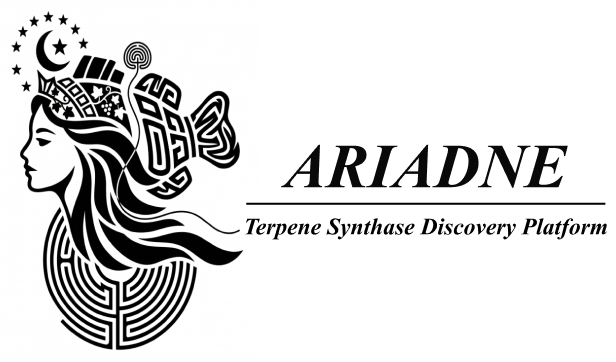

<p align="center">
  
</p>

<p align="center">
  <a href="./README.md"><strong>English</strong></a>
</p>

<p align="center">
  🧬 <strong>Ariadne</strong><br>
  一个面向珊瑚 TPS 挖掘与 CeeSs 优先识别的平台
</p>

<p align="center">
  
  
  
  
  
  
  <a href="./docs/index.md"></a>
</p>

> Ariadne 是一个面向研究场景的平台，用于珊瑚 TPS 挖掘、CeeSs 优先识别以及下游系统发育分析。  
> 当前版本采用 tree-native 的四阶段主线流程：`discovery -> filtering -> classification -> phylogeny`。

## 🪸 简介

发现一个新的 terpene synthase 很重要，但更难的问题通常是识别“哪个 synthase 对应某个特定产物”。Ariadne 就是围绕这个问题构建的。

这个平台聚焦于珊瑚 TPS 发现和 CeeSs 优先识别，结合了 HMM 引导的候选筛选、TPS 特征空间分类、可选的 ESM 辅助 `cembrene A / cembrene B` 候选打分，以及直接面向 MAFFT + IQ-TREE 的系统发育分析流程。

它的核心设计原则很简单：同一个经过整理的 `tree/` 参考目录，应该同时服务于 discovery、候选解释和最终系统发育定位，让整个流程始终处在一致的生物学背景中。

## ✨ 主要贡献

- Tree-native：同一个 `tree/` 目录贯穿 discovery、classification 和 phylogeny。
- Feature-space 解释能力：候选序列会被投影到 TPS HMM score space，用于最近参考分配和可视化筛查。
- 面向 CeeSs 的优先识别：如果提供 `TPS/TPS.xlsx` 并安装 ESM 依赖，Ariadne 可以继续筛选更像 `cembrene A / cembrene B` 的 coral-like candidates。
- 建树衔接直接：过滤后的候选可以直接进入 MAFFT alignment 和 IQ-TREE 推断。

## 🔬 四阶段流程

1. `discovery`  
   用 query HMM 在蛋白输入或转录组推断的 ORF 中搜索 TPS 候选。
2. `filtering`  
   做 coverage 过滤、最短长度过滤、近重复去冗余，并可额外移除已经存在于参考集中的候选。
3. `classification`  
   将候选和参考一起打到 TPS HMM library 上，构建特征矩阵、做 embedding，并给出最近参考来源。
4. `phylogeny`  
   将过滤后的候选和参考序列合并，运行 MAFFT，再用 IQ-TREE 生成最终系统发育树。

如果没有显式传入 `--query-hmm` 或 `--tps-hmm-dir`，Ariadne 会在 `ariadne/hmm/` 有内置资源时优先复用它们；否则再从 `tree/` 自动构建。

## 🗺️ 方法

<p align="center">
  
</p>

<p align="center">
  这张结构图概括了当前版本的软件框架：同一个 tree-native 参考骨架贯穿 discovery、filtering、特征空间 classification、可选的 CeeSs 打分以及下游 phylogeny。
</p>

## ⚙️ 安装

推荐环境：Python `3.11`，优先使用仓库自带的 Conda 环境。

```bash
git clone https://github.com/zhaoruijiang26/Ariadne.git
cd Ariadne
conda env create -f environment.yml
conda activate ariadne
pip install -e .
```

最小运行依赖：

- Python `>= 3.9`
- `mafft`
- `iqtree` 或 `iqtree2`
- `numpy >= 1.24`
- `openpyxl >= 3.1`
- `pyhmmer >= 0.12.0`
- `pyrodigal >= 3.7.0`
- `scikit-learn >= 1.4`

如果需要 CeeSs 的 ESM 打分，再安装：

```bash
pip install -e '.[esm]'
```

## 🚀 快速开始

### 蛋白输入的一键完整流程

```bash
ariadne run \
  --protein-folder input/ \
  --reference-dir tree/ \
  --output-dir results/
```

预期的顶层输出结构：

```text
results/
├── 01_discovery/
├── 02_filtering/
├── 03_classification/
├── 04_phylogeny/
└── pipeline_summary.tsv
```

### 转录组模式

```bash
ariadne run \
  --transcriptomes sample1.fasta sample2.fasta \
  --reference-dir tree/ \
  --output-dir results_from_transcriptomes/
```

### 只做分类

```bash
ariadne classify \
  --candidates results/02_filtering/candidates.filtered.faa \
  --reference-dir tree/ \
  --output-dir results_classification/
```

### 只做建树

```bash
ariadne phylogeny \
  --candidates results/02_filtering/candidates.filtered.faa \
  --reference-dir tree/ \
  --output-dir results_phylogeny/
```

## 🧬 可选的 CeeSs 模式

如果仓库中存在 `TPS/TPS.xlsx`，并且已经安装可选的 ESM 依赖，那么 `run` 和 `classify` 在第三阶段会额外执行一层 CeeSs 打分。这层判别逻辑位于 `ariadne.model`，使用冻结的 ESM2 embedding 加一个可训练的小头，默认是 MLP，同时支持 logistic regression 和 Barlow Twins 对比学习变体。

这层 CeeSs 头是一层直接的多分类：

1. 多分类 TPS 头会直接给每条 `coral-like` candidate 预测细粒度 `Type`。
2. `P(CeeSs)` 由 workbook 中被标记为 CeeSs 正类的所有标签概率求和得到；如果 `TPS.xlsx` 里没有显式的 `CeeSs_group`/`CeeSs` 列，Ariadne 才会回退到只把 `cembrene A` 和 `cembrene B` 当作正类。

常见的额外输出包括：

- `ceess_predictions.tsv`（包含 `esm_type_prediction`、`esm_ceess_probability`，以及按类型展开的 `esm_type_probability_*` 字段）
- `ceess_candidates.tsv`
- `ceess_candidates.fasta`
- `ceess_embedding.svg`
- `ceess_model_metrics.tsv`
- `type_score_hits/`、`type_score_fastas/`

## 🗂️ 仓库结构

```text
Ariadne/
├── ariadne/                # 核心包与内置 HMM 资源
├── docs/                   # 项目文档
├── fig/                    # logo 与图像资源
├── input/                  # 示例蛋白输入
├── output/                 # 历史示例输出
├── TPS/                    # 可选的珊瑚 TPS 标注表
├── tree/                   # 默认参考 FASTA 集合
├── environment.yml
├── install.sh
└── pyproject.toml
```

## ⌨️ 命令行参数说明

| 命令 | 用途 |
|---|---|
| `ariadne run` | 完整四阶段流程 |
| `ariadne discover` | 第一阶段：HMM 候选发现 |
| `ariadne filter` | 第二阶段：质量过滤与去冗余 |
| `ariadne classify` | 第三阶段：特征空间分类 |
| `ariadne phylogeny` | 第四阶段：MAFFT 比对 + IQ-TREE 建树 |
| `ariadne prepare-references` | 准备参考 FASTA 文件 |
| `ariadne build-hmm` | 从比对文件构建单个 HMM |
| `ariadne build-tps-hmm-library` | 从多个比对文件构建 TPS HMM 库 |

### `ariadne run` — 完整流程

| 参数 | 默认值 | 说明 |
|---|---|---|
| `--protein-folder PATH` | `None` | 蛋白 FASTA 文件目录 |
| `--transcriptomes PATH …` | `None` | 转录组 FASTA；用 Pyrodigal 预测 ORF |
| `--protein-glob GLOB …` | 自动 | 覆盖 `--protein-folder` 下的递归 glob 模式 |
| `--query-hmm PATH` | 内置 | 用于发现的 profile HMM；缺失时从 `tree/` 自动构建 |
| `--reference-dir PATH` | **必填** | tree-native 参考 FASTA 目录 |
| `--output-dir PATH` | **必填** | 输出根目录 |
| `--hmm-name NAME` | `ariadne_query` | 自动构建 HMM 时写入的名称 |
| `--discovery-min-score FLOAT` | `None` | 发现阶段的最低 HMM bitscore |
| `--discovery-max-evalue FLOAT` | `None` | 发现阶段的最大 E-value |
| `--min-coverage FLOAT` | `10.0` | 过滤阶段的最低测序覆盖度 |
| `--min-length INT` | `300` | 过滤阶段的最短蛋白长度（aa） |
| `--identity-threshold FLOAT` | `0.95` | 近重复折叠阈值 |
| `--tps-hmm-dir PATH` | 自动 | TPS HMM 库目录；优先内置，否则从 `tree/` 构建 |
| `--top-k INT` | `5` | 最近参考投票邻居数 |
| `--tree-neighbors INT` | `12` | 构建局部上下文树的邻居数 |
| `--ceess-xlsx PATH` | `TPS/TPS.xlsx` | 用于 CeeSs 打分的有标注珊瑚 TPS 工作簿 |
| `--skip-ceess-model` | `False` | 跳过 ESM CeeSs 打分阶段 |
| `--ceess-threshold FLOAT` | `0.9` | 写入 `ceess_candidates.tsv` 的最低 P(CeeSs) |
| `--ceess-classifier` | `mlp` | 分类头：`mlp`、`logreg` 或 `contrastive` |
| `--ceess-model-name NAME` | `facebook/esm2_t33_650M_UR50D` | ESM2 预设名或 Hugging Face 模型 ID |
| `--ceess-batch-size INT` | `4` | ESM2 推理 batch size |
| `--ceess-max-length INT` | `2048` | ESM2 最大 token 长度 |
| `--ceess-device DEVICE` | 自动 | torch 设备，如 `cuda:0` 或 `cpu` |
| `--ceess-cv-folds INT` | `5` | 交叉验证折数 |
| `--ceess-random-state INT` | `0` | 随机种子 |
| `--ceess-epochs INT` | `200` | MLP 训练轮数 |
| `--ceess-hidden-dim INT` | `128` | MLP 隐层宽度 |
| `--ceess-dropout FLOAT` | `0.1` | MLP dropout 率 |
| `--ceess-learning-rate FLOAT` | `1e-3` | MLP 学习率 |
| `--ceess-weight-decay FLOAT` | `1e-4` | MLP 权重衰减 |
| `--ceess-train-batch-size INT` | `8` | MLP 训练 batch size |
| `--ceess-barlow-representation-dim INT` | `None` | Barlow Twins 编码器宽度（仅 `contrastive`） |
| `--ceess-barlow-projection-dim INT` | `None` | Barlow Twins 投影头宽度（仅 `contrastive`） |
| `--ceess-barlow-redundancy-weight FLOAT` | `0.005` | Barlow Twins 冗余惩罚（仅 `contrastive`） |
| `--ceess-mlp-checkpoint PATH` | `None` | 预训练 MLP `.pt` 检查点；加载后跳过训练 |
| `--skip-phylogeny` | `False` | 跳过 MAFFT + IQ-TREE |
| `--mafft-bin PATH` | 自动 | MAFFT 可执行文件路径 |
| `--mafft-mode FLAG` | `--auto` | MAFFT 比对模式 |
| `--iqtree-bin PATH` | 自动 | IQ-TREE 可执行文件路径 |
| `--iqtree-model MODEL` | `LG` | IQ-TREE 替换模型 |
| `--iqtree-threads INT\|AUTO` | `AUTO` | IQ-TREE 线程数 |
| `--iqtree-bootstrap INT` | `None` | 超快速 bootstrap 重复数 |
| `--no-iqtree-fast` | `False` | 禁用 IQ-TREE `--fast` 模式 |

### `ariadne discover`

| 参数 | 默认值 | 说明 |
|---|---|---|
| `--protein-folder PATH` | `None` | 蛋白 FASTA 目录 |
| `--transcriptomes PATH …` | `None` | 转录组 FASTA 输入 |
| `--protein-glob GLOB …` | 自动 | 递归搜索模式 |
| `--hmm PATH` | **必填** | 发现用 HMM |
| `--output-dir PATH` | **必填** | 发现输出目录 |
| `--min-score FLOAT` | `None` | 最低 HMM bitscore |
| `--max-evalue FLOAT` | `None` | 最大 E-value |

### `ariadne filter`

| 参数 | 默认值 | 说明 |
|---|---|---|
| `--input-fasta PATH` | **必填** | 候选蛋白 FASTA |
| `--output-dir PATH` | **必填** | 过滤输出目录 |
| `--min-coverage FLOAT` | `10.0` | 最低测序覆盖度 |
| `--min-length INT` | `300` | 最短蛋白长度（aa） |
| `--identity-threshold FLOAT` | `0.95` | 近重复折叠阈值 |
| `--reference-dir PATH` | `None` | 参考目录；匹配参考的候选记录在 `reference_matches.tsv` 中，**保留**于过滤输出 |

### `ariadne classify`

接受与 `ariadne run` 相同的所有 `--ceess-*` 参数（见上表）。

| 参数 | 默认值 | 说明 |
|---|---|---|
| `--candidates PATH` | **必填** | 过滤后的候选 FASTA |
| `--reference-dir PATH` | **必填** | 参考 FASTA 目录 |
| `--output-dir PATH` | **必填** | 分类输出目录 |
| `--tps-hmm-dir PATH` | 自动 | TPS HMM 库目录 |
| `--top-k INT` | `5` | 投票邻居数 |
| `--tree-neighbors INT` | `12` | 局部上下文树邻居数 |

### `ariadne phylogeny`

| 参数 | 默认值 | 说明 |
|---|---|---|
| `--candidates PATH` | **必填** | 过滤后的候选 FASTA |
| `--reference-dir PATH` | **必填** | 参考 FASTA 目录 |
| `--output-dir PATH` | **必填** | 建树输出目录 |
| `--mafft-bin PATH` | 自动 | MAFFT 可执行文件 |
| `--mafft-mode FLAG` | `--auto` | MAFFT 比对模式 |
| `--iqtree-bin PATH` | 自动 | IQ-TREE 可执行文件 |
| `--iqtree-model MODEL` | `LG` | 替换模型 |
| `--iqtree-threads INT\|AUTO` | `AUTO` | 线程数 |
| `--iqtree-bootstrap INT` | `None` | bootstrap 重复数 |
| `--no-iqtree-fast` | `False` | 禁用 fast 模式 |

### `ariadne prepare-references`

| 参数 | 默认值 | 说明 |
|---|---|---|
| `--coral PATH` | `None` | 珊瑚参考 FASTA |
| `--coral-limit INT` | `None` | 最大珊瑚序列数 |
| `--insect-xlsx PATH` | `None` | 昆虫 TPS Excel 工作簿 |
| `--insect-limit INT` | `None` | 最大昆虫序列数 |
| `--bacteria-fasta PATH` | `None` | 细菌 TPS FASTA |
| `--fungal-fasta PATH` | `None` | 真菌 TPS FASTA |
| `--plant-fasta PATH` | `None` | 植物 TPS FASTA |
| `--extra-fasta PATH …` | `None` | 额外 FASTA 文件 |
| `--output-dir PATH` | **必填** | 输出目录 |

### `ariadne build-hmm` / `ariadne build-tps-hmm-library`

| 命令 | 参数 | 说明 |
|---|---|---|
| `build-hmm` | `--alignment PATH`（必填） | 输入比对或 FASTA 文件 |
| `build-hmm` | `--output PATH`（必填） | 输出 `.hmm` 文件 |
| `build-hmm` | `--name NAME` | HMM profile 名称 |
| `build-tps-hmm-library` | `--alignment NAME=PATH …`（必填） | 命名比对文件 |
| `build-tps-hmm-library` | `--output-dir PATH`（必填） | 输出 HMM 库目录 |

> **注意：** 全局参数（`--verbose`、`--log-file`）必须放在子命令之前：`ariadne --verbose run ...`

完整 CLI 文档：[docs/cli-reference.md](./docs/cli-reference.md)

## 📖 文档入口

- [Getting Started](./docs/index.md)
- [CLI Reference](./docs/cli-reference.md)
- [Outputs](./docs/outputs.md)
- [CeeSs / ESM Type](./docs/esm-type.md)
- [Citation](./docs/citation.md)

## 📄 引用

```bibtex
@software{jiang2026ariadne,
  author       = {Jiang, Zhaorui},
  title        = {Ariadne: A coral-centered terpene synthase discovery and CeeSs prioritization platform},
  year         = {2026},
  url          = {https://github.com/zhaoruijiang26/Ariadne},
  version      = {1.0.0}
}
```
