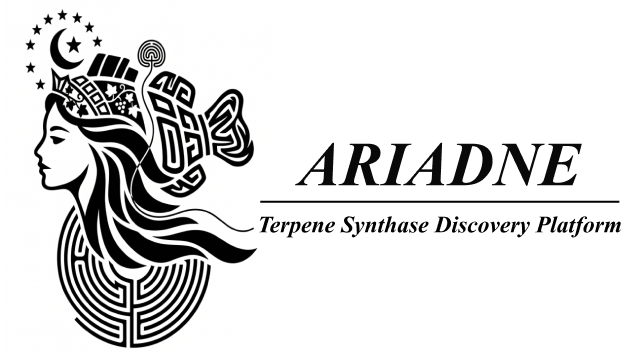

<p align="center">
  
</p>

<p align="center">
  <a href="./README.md">English</a> &nbsp;·&nbsp;
  <a href="./docs/index.md">文档</a> &nbsp;·&nbsp;
  <a href="#快速开始">快速开始</a> &nbsp;·&nbsp;
  <a href="#引用">引用</a>
</p>

<p align="center">
  
  
  
  
</p>

---

## 概览

**Ariadne** 是一个面向萜烯合成酶（TPS）候选发现的研究级 Python 包和命令行工具。它将转录组或蛋白 FASTA 输入转换为可审计的四阶段流程：

```text
Discovery -> Filtering -> Classification -> PCA/LDA visualization
```

当提供 `TPS.xlsx` 并安装 `[esm]` 可选依赖时，Ariadne 可进一步使用 ESM2 对 coral-like 的 **cembrene-class synthase（CeeSs）** 候选进行优先级识别。

## 核心功能

- 支持从转录组或预测蛋白 FASTA 进行 HMM 候选发现。
- 覆盖度、长度与近重复过滤，并输出 TSV 审计表。
- 基于参考序列空间进行 TPS 分类，并保留近邻证据。
- 输出 PCA/LDA SVG 图（含 LD1–LD2 / LD1–LD3 / LD2–LD3 三面板），用于候选人工筛选。
- 可选 ESM2 CeeSs 打分与候选 FASTA 导出。

## 安装

推荐方式：

```bash
git clone https://github.com/zhaorui-bi/Ariadne.git
cd Ariadne
conda env create -f environment.yml
conda activate ariadne
pip install -e .
```

最小安装：

```bash
pip install -e .
```

启用 ESM2 打分：

```bash
pip install -e '.[esm]'
```

## 快速开始

准备参考 FASTA 目录后运行：

```bash
ariadne run \
  --protein-folder my_proteins/ \
  --reference-dir reference_fastas/ \
  --ceess-xlsx TPS.xlsx \
  --output-dir results/
```

转录组模式：

```bash
ariadne run \
  --transcriptomes sample1.fasta sample2.fasta \
  --reference-dir reference_fastas/ \
  --output-dir results_from_transcriptomes/
```

核心输出结构：

```text
results/
├── 01_discovery/
├── 02_filtering/
├── 03_classification/
└── pipeline_summary.tsv
```

## 文档

- [Getting Started](./docs/getting-started.md)
- [Method](./docs/method.md)
- [Advanced Usage](./docs/advanced-usage.md)
- [Software Architecture](./docs/software-architecture.md)
- [CLI Reference](./docs/cli-reference.md)
- [Outputs](./docs/outputs.md)
- [CeeSs Classifier](./docs/esm-type.md)

## 开发

```bash
pip install -e '.[dev]'
python -m ariadne --help
mkdocs build --strict
```

## 引用

```bibtex
@article{wang2026cembrene,
  author  = {Wang, Yinhao and Yu, Mengmeng and Jiang, Zhaorui and Zhou, Chengyu and Feng, Wei and Yu, Ke and Ju, Jianhua and Li, Feng},
  title   = {Identification of Cembrene Synthases from Coral Reveals the Polyphyletic Origins of Cembranoid Biosynthesis},
  year    = {2026}
}
```

## 许可证

基于 [MIT License](./LICENSE) 发布。
