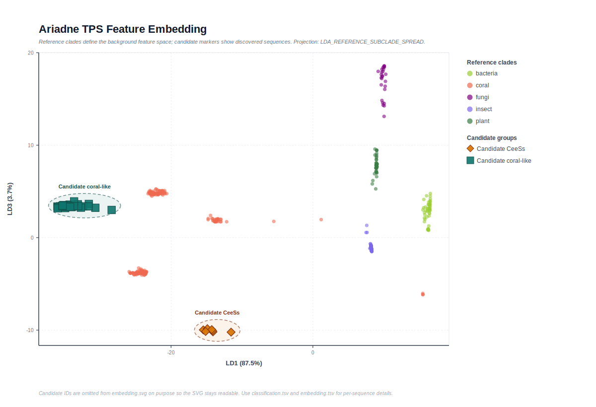

<div class="hero-panel">
  <div class="hero-copy">
    <h1>Ariadne</h1>
    <p><strong>A coral-centered terpene synthase discovery and CeeSs prioritization platform</strong> for genome mining, feature-space interpretation, and phylogenetic analysis.</p>
    <p>Ariadne turns a curated <code>tree/</code> reference directory into a practical four-stage workflow: HMM-guided discovery, filtering, TPS feature-space classification, and alignment-driven phylogeny.</p>
    <div class="hero-actions">
      <a class="md-button md-button--primary" href="getting-started/">Get Started</a>
      <a class="md-button" href="cli-reference/">CLI Reference</a>
      <a class="md-button" href="https://github.com/zhaoruijiang26/Ariadne">GitHub</a>
    </div>
    <div class="hero-meta">
      <span class="hero-pill">Python 3.11+</span>
      <span class="hero-pill">MkDocs + Material</span>
      <span class="hero-pill">MAFFT + IQ-TREE</span>
      <span class="hero-pill">4-stage pipeline</span>
    </div>
  </div>
  <div class="hero-visual">
    
  </div>
</div>

## 📢 News

- `2026-04-02` Architecture refactored to a clean 7-module layout: `utils`, `data`, `search`, `filter`, `embed`, `model`, `tree`. Old verbose names retired.
- `2026-04-02` Filtering updated: candidates matching reference sequences are now **retained** in `candidates.filtered.faa`; matches are still logged in `reference_matches.tsv` for traceability.
- `2026-04-02` Test run benchmark: 100 candidates discovered → 36 retained after filtering → 36 classified as coral-like → **5 CeeSs candidates** shortlisted (P(CeeSs) ≥ 0.9).
- `2026-03-23` The repository introduction was updated around the new CeeSs framing, reflecting Ariadne as a platform for coral TPS mining and CeeSs prioritization.
- `2026-03-22` Ariadne now ships with an English documentation site built with MkDocs + Material for Read the Docs deployment.
- `2026-03-21` The software workflow was simplified to a focused four-stage pipeline: `discovery -> filtering -> classification -> phylogeny`.

## 🪸 Introduction

The rational discovery of terpene synthases by genome mining is an attractive route toward new natural-product scaffolds, but the identification of TPSs responsible for specific end products remains substantially harder than the discovery of novel TPS genes alone.

Cnidarians produce diverse terpenoids as defensive metabolites, making coral genomes an especially compelling source for TPS discovery. Ariadne was therefore designed as a practical platform for both genome-wide coral TPS mining and the targeted prioritization of product-specific synthases, which we formalize here as <strong>CeeSs</strong>.

In the associated study context, this platform supported the identification of CeeSs candidates, experimental validation through heterologous expression with 80% accuracy, and phylogenetic analyses that helped interpret the evolutionary trajectory of distinct CeeSs and guide ancestral enzyme engineering.

## ✨ Why Ariadne?

<div class="card-grid card-grid--three">
  <div class="paper-card">
    <h3>🌊 Tree-native by design</h3>
    <p>A single curated <code>tree/</code> directory drives discovery, feature-space classification, and phylogenetic reconstruction.</p>
  </div>
  <div class="paper-card">
    <h3>🧭 Feature-space aware</h3>
    <p>Candidates are embedded in a TPS HMM score space, allowing fast nearest-reference assignment and visual screening.</p>
  </div>
  <div class="paper-card">
    <h3>🌳 Phylogeny-ready outputs</h3>
    <p>After classification, Ariadne directly builds a MAFFT alignment and an IQ-TREE phylogeny without extra manual glue code.</p>
  </div>
</div>

<div class="mini-kpi">
  <div class="paper-card"><strong>4</strong><span>Stages</span></div>
  <div class="paper-card"><strong>1</strong><span>Reference Root</span></div>
  <div class="paper-card"><strong>3</strong><span>Core Output Types</span></div>
  <div class="paper-card"><strong>0</strong><span>Benchmark Dependency</span></div>
</div>

## 🧠 Method At A Glance

<figure class="paper-figure">
  
  <figcaption>
    Figure 1. Ariadne uses a four-stage, tree-native workflow. The same <code>tree/</code> reference collection is reused across discovery, classification, and phylogeny.
  </figcaption>
</figure>

<div class="overview-grid">
  <div class="paper-card">
    <h3>01. Discovery</h3>
    <p>Build a discovery HMM from the default coral reference under <code>tree/</code>, then search protein inputs or transcriptome-derived ORFs for TPS candidates.</p>
  </div>
  <div class="paper-card">
    <h3>02. Filtering</h3>
    <p>Apply coverage filtering, minimum-length checks, and near-duplicate collapsing to keep a clean candidate set.</p>
  </div>
  <div class="paper-card">
    <h3>03. Classification</h3>
    <p>Score all references and candidates against a TPS HMM library, embed them in feature space, and assign the most likely reference source.</p>
  </div>
  <div class="paper-card">
    <h3>04. Phylogeny</h3>
    <p>Merge filtered candidates with reference sequences, run MAFFT, and reconstruct the final phylogeny using IQ-TREE.</p>
  </div>
</div>

## 🖼️ Results Preview

<figure class="paper-figure">
  
  <figcaption>
    Figure 2. Current bundled local result preview, synced from <code>result/03_classification/embedding.svg</code>. In this local run, <code>36</code> coral-like candidates were scored and <code>5</code> were retained as final CeeSs candidates (P(CeeSs) ≥ 0.9).
  </figcaption>
</figure>

## 🚀 Quick Start

```bash
ariadne run \
  --protein-folder input/ \
  --reference-dir tree/ \
  --output-dir results/
```

This command will:

- use the bundled discovery query HMM from `ariadne/hmm/query.hmm`
- use the bundled TPS HMM library from `ariadne/hmm/`
- discover and filter candidates
- classify them in TPS feature space
- directly generate the final alignment and phylogeny

## 🧭 Where To Go Next

- Start with [Getting Started](getting-started.md) for installation and your first run.
- Read [Method](method.md) for a stage-by-stage explanation of the pipeline.
- Open [Tutorials](tutorials.md) for practical command sequences and example analysis flow.
- Use [CLI Reference](cli-reference.md) when tuning parameters.
- Check [Outputs](outputs.md) to understand every key artifact produced by the pipeline.
