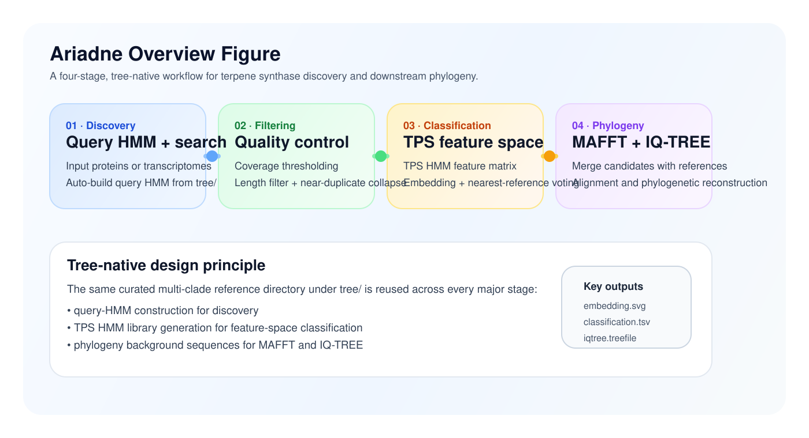
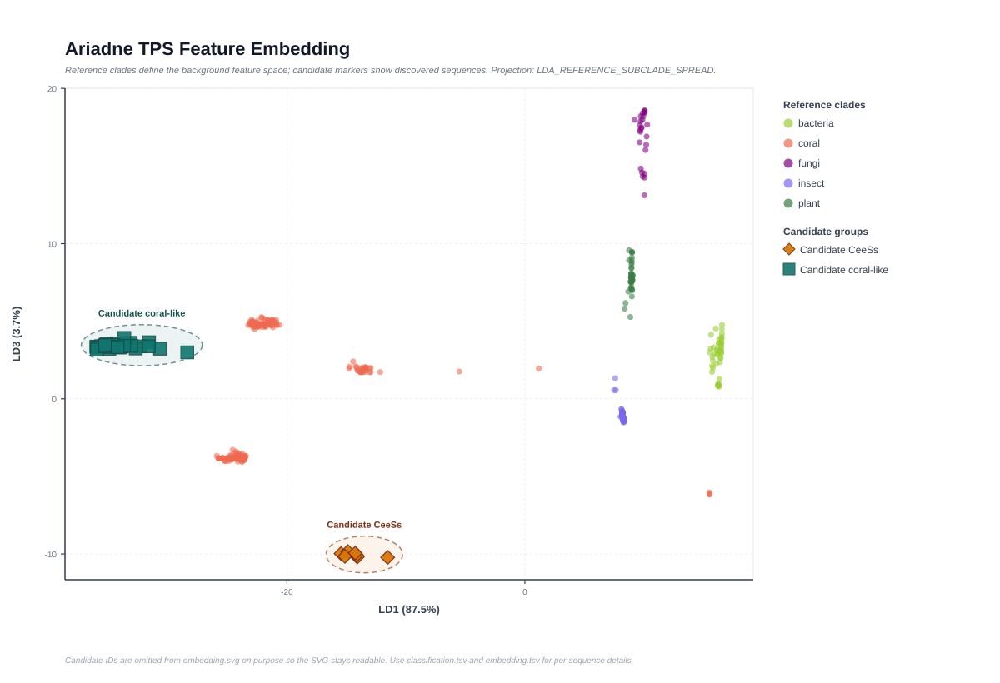

<div class="hero-panel">
  <div class="hero-copy">
    <h1>Ariadne</h1>
    <p><strong>A tree-native platform for coral terpene synthase discovery and cembrene-class synthase (CeeSs) prioritization.</strong></p>
    <p>Ariadne turns a single curated <code>tree/</code> reference directory into a four-stage workflow — profile-HMM-guided discovery, quality filtering, TPS feature-space classification, and alignment-driven phylogeny — so that discovery, interpretation, and evolutionary placement all share one biological frame of reference.</p>
    <div class="hero-actions">
      <a class="md-button md-button--primary" href="getting-started/">Get Started</a>
      <a class="md-button" href="method/">Method</a>
      <a class="md-button" href="https://github.com/zhaorui-bi/Ariadne">GitHub</a>
    </div>
    <div class="hero-meta">
      <span class="hero-pill">Python 3.9+</span>
      <span class="hero-pill">Profile-HMM feature space</span>
      <span class="hero-pill">Optional ESM2 scoring</span>
      <span class="hero-pill">MAFFT + IQ-TREE</span>
    </div>
  </div>
  <div class="hero-visual">
    
  </div>
</div>

## Background

Terpene synthases (TPSs) produce the largest and most structurally diverse family of natural products. Discovering candidate TPS genes by genome mining is now routine; the harder problem is **product assignment** — determining which of many candidate synthases produces a specific metabolite.

This problem is especially pointed in corals (Cnidaria), which deploy diverse terpenoids as defensive metabolites and whose genomes encode hundreds of candidate TPSs. Among these, the cembrene-type diterpenoids are of particular interest, yet few of their synthases have been experimentally characterized. Ariadne was built to address both halves of the task at once: genome-wide coral TPS mining, and the targeted prioritization of product-specific synthases, which we refer to throughout as **cembrene-class synthases (CeeSs)**.

In the associated study, this platform supported the identification of CeeSs candidates, experimental validation through heterologous expression (80% accuracy), and phylogenetic analyses that helped interpret the evolutionary trajectory of distinct CeeSs and guide ancestral enzyme engineering.

## Design principles

<div class="card-grid card-grid--three">
  <div class="paper-card">
    <h3>Tree-native by design</h3>
    <p>One curated <code>tree/</code> directory drives discovery, feature-space classification, and phylogenetic reconstruction — no per-stage reference drift.</p>
  </div>
  <div class="paper-card">
    <h3>Feature-space aware</h3>
    <p>Candidates are embedded in a TPS profile-HMM score space, enabling nearest-reference label transfer and direct visual screening.</p>
  </div>
  <div class="paper-card">
    <h3>Phylogeny-ready</h3>
    <p>After classification, Ariadne builds a MAFFT alignment and an IQ-TREE phylogeny directly, with no manual glue between stages.</p>
  </div>
</div>

<div class="mini-kpi">
  <div class="paper-card"><strong>4</strong><span>Pipeline Stages</span></div>
  <div class="paper-card"><strong>1</strong><span>Reference Backbone</span></div>
  <div class="paper-card"><strong>5</strong><span>Reference Clades</span></div>
  <div class="paper-card"><strong>0</strong><span>Manual Glue Steps</span></div>
</div>

## Method at a glance

<figure class="paper-figure">
  
  <figcaption>
    Figure 1. The four-stage, tree-native Ariadne workflow. The same <code>tree/</code> reference collection is reused across discovery, classification, and phylogeny.
  </figcaption>
</figure>

<div class="overview-grid">
  <div class="paper-card">
    <h3>1 · Discovery</h3>
    <p>Build a discovery HMM from the coral reference under <code>tree/</code>, then search protein inputs or transcriptome-derived ORFs for TPS candidates.</p>
  </div>
  <div class="paper-card">
    <h3>2 · Filtering</h3>
    <p>Apply coverage and minimum-length filters and collapse near-duplicates to keep a clean, traceable candidate set.</p>
  </div>
  <div class="paper-card">
    <h3>3 · Classification</h3>
    <p>Score references and candidates against a TPS HMM library, embed them with supervised LDA, and assign nearest-reference labels — with optional ESM2 CeeSs scoring.</p>
  </div>
  <div class="paper-card">
    <h3>4 · Phylogeny</h3>
    <p>Merge filtered candidates with references, align with MAFFT, and reconstruct a maximum-likelihood phylogeny with IQ-TREE.</p>
  </div>
</div>

## Representative result

<figure class="paper-figure">
  
  <figcaption>
    Figure 2. TPS feature-space embedding from a representative run: 100 candidates discovered → 36 retained after filtering → 36 classified as coral-like → 5 CeeSs candidates shortlisted at <code>P(CeeSs) ≥ 0.9</code> (ESM2-650M, MLP head).
  </figcaption>
</figure>

## Quick start

```bash
ariadne run \
  --protein-folder input/ \
  --reference-dir tree/ \
  --output-dir results/
```

This single command will:

- use the bundled discovery query HMM (`ariadne/hmm/query.hmm`) and TPS HMM library (`ariadne/hmm/`);
- discover and filter candidates;
- classify them in TPS feature space (with ESM2 CeeSs scoring when `TPS/TPS.xlsx` and the `[esm]` extra are available);
- align with MAFFT and reconstruct the final phylogeny with IQ-TREE.

## Where to go next

- **[Getting Started](getting-started.md)** — installation and your first run.
- **[Method](method.md)** — a stage-by-stage explanation of the pipeline.
- **[Tutorials](tutorials.md)** — practical command sequences and analysis pathways.
- **[CLI Reference](cli-reference.md)** — every command and parameter.
- **[Outputs](outputs.md)** — how to read every artifact the pipeline produces.
