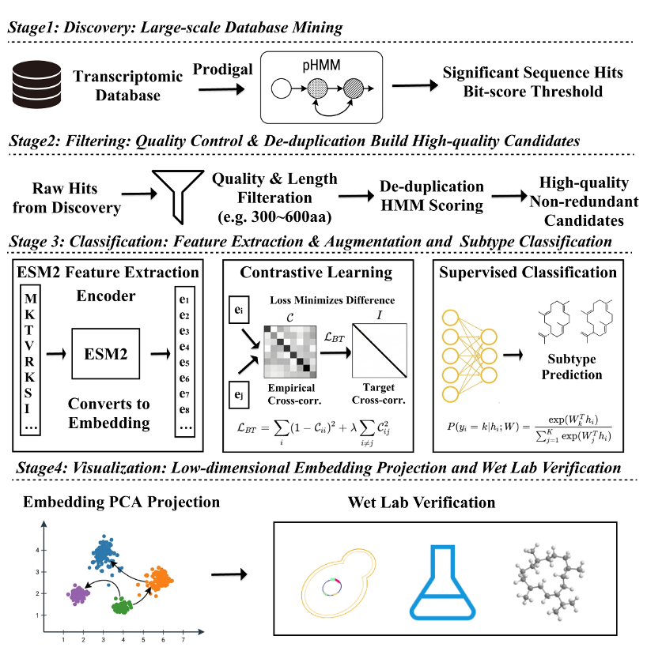

# Ariadne

<section class="research-hero" markdown>
<div markdown>


<span class="research-hero__eyebrow">Journal of Natural Products · 2026</span>

**Genome-wide targeted mining of coral terpene synthases**

<div class="research-hero__subtitle" markdown>
Ariadne is the computational platform reported by Wang et al. for discovering coral TPS homologs and prioritizing cembrene-class synthases (CeeSs). It turns transcriptome or protein FASTA input into an auditable path from HMM hits to experimentally tractable candidates.
</div>

<div class="research-hero__meta" markdown>
**Scope.** Discovery, quality filtering, reference-space classification, PCA/LDA visualization, and optional ESM2 CeeSs scoring. Phylogeny and enzyme engineering in the article are downstream analyses enabled by these candidates.
</div>

<div class="research-hero__actions" markdown>
[Get Started](getting-started.md){ .md-button .md-button--primary }
[Read the Paper](https://doi.org/10.1021/acs.jnatprod.6c00686){ .md-button }
[Method](method.md){ .md-button }
</div>
</div>

<div class="research-hero__panel" markdown>
**Publication**

- Wang et al., *J. Nat. Prod.* **2026**
- DOI: [10.1021/acs.jnatprod.6c00686](https://doi.org/10.1021/acs.jnatprod.6c00686)
- Software version: `ariadne-tps 1.1.0`
- Docs: [ariadne-platform.readthedocs.io](https://ariadne-platform.readthedocs.io/en/latest/)
- Code: [zhaorui-bi/Ariadne](https://github.com/zhaorui-bi/Ariadne)
</div>
</section>

<aside class="pub-banner" markdown>
<p class="icon-mark"></p>
<div markdown>
<p class="pub-banner__meta">Accompanying article</p>
**Identification of Cembrene Synthases Uncovers Polyphyletic Origins of 14-Membered Carbocyclic Cembranoids Biosynthesis in Corals**
</div>
<div markdown>
[Open DOI](https://doi.org/10.1021/acs.jnatprod.6c00686){ .md-button }
</div>
</aside>

## Published findings

These numbers come from the *Journal of Natural Products* study. They describe the experimental campaign that used Ariadne, not the output of a default local run.

<div class="highlight-grid" markdown>

<div class="highlight-card" markdown>
<p class="icon-mark"></p>
**5**
<span>Cembrene synthases identified</span>
</div>

<div class="highlight-card" markdown>
<p class="icon-mark"></p>
**80%**
<span>Prediction accuracy on 90 TPS homologs</span>
</div>

<div class="highlight-card" markdown>
<p class="icon-mark"></p>
**14**
<span>Membered cembranoid rings</span>
</div>

<div class="highlight-card" markdown>
<p class="icon-mark"></p>
**3**
<span>Low-similarity enzymes in yeast</span>
</div>

</div>

The published set includes two enzymes closely related to known cembrene B synthases and three distant enzymes confirmed by heterologous expression. Rapid identification of those CeeSs then supported phylogenetic reconstruction of the coral enzyme family and engineering of an early-diverging synthase that formed an unreported cembrene scaffold.

## Scientific context

Cembranoids are coral-derived natural products built on a 14-membered carbocyclic skeleton. Their chemical synthesis is demanding, and only two biosynthetic precursors had been obtained from fifteen previously characterized coral enzymes across six studies. TPS genome mining often rediscovers the same products. Ariadne was designed to make that search targeted: retain hit-level evidence, collapse redundant fragments, place candidates in a shared reference space, and highlight CeeSs before wet-lab work.

## Algorithm framework

<figure class="algorithm-figure" markdown="1">

<figcaption><strong>Figure 1.</strong> Ariadne starts from transcriptomic or protein resources, screens sequence hits with profile-HMM evidence, filters candidates by quality and redundancy, extracts ESM2 and profile-space representations, and prioritizes subtypes for visualization and wet-lab follow-up.</figcaption>
</figure>

## Four computational stages

<div class="workflow-map workflow-map--four" markdown>

<div class="workflow-step" markdown>
<p class="icon-mark"></p>
<span class="stage-label">Stage I</span>
### Discovery
Search transcriptome-derived ORFs or predicted protein FASTAs with a query HMM. The result is a candidate universe with traceable hit evidence.

Primary artifact: `candidates.protein.faa`
</div>

<div class="workflow-step" markdown>
<p class="icon-mark"></p>
<span class="stage-label">Stage II</span>
### Filtering
Apply coverage, length, and near-duplicate controls to build a compact, non-redundant candidate set for classification.

Primary artifact: `candidates.filtered.faa`
</div>

<div class="workflow-step" markdown>
<p class="icon-mark"></p>
<span class="stage-label">Stage III</span>
### Classification
Place candidates and references in the same TPS feature space, then report nearest-neighbor evidence and optional ESM2 CeeSs probabilities.

Primary artifact: `classification.tsv`
</div>

<div class="workflow-step" markdown>
<p class="icon-mark"></p>
<span class="stage-label">Stage IV</span>
### Visualization
Project the feature space with LDA or PCA. The three-panel SVG follows Figure S2: lineage-colored references, orange CeeSs diamonds, and teal non-CeeSs squares.

Primary artifact: `embedding_3d_sections.svg`
</div>

</div>

## What the platform does

<div class="capability-grid" markdown>

<div class="capability-card" markdown>
<p class="icon-mark"></p>
### Targeted TPS mining
Genome- or transcriptome-wide screening against a user-supplied reference FASTA directory. Ariadne can build the needed HMM resources when prebuilt profiles are not supplied.
</div>

<div class="capability-card" markdown>
<p class="icon-mark"></p>
### Auditable intermediates
Every stage writes TSV evidence so a sequence can be kept, removed, assigned, or re-ranked without collapsing the run into a single black-box label.
</div>

<div class="capability-card" markdown>
<p class="icon-mark"></p>
### CeeSs prioritization
When `TPS.xlsx` and the `[esm]` extras are available, coral-like candidates receive ESM2 type predictions and an aggregated CeeSs probability.
</div>

<div class="capability-card" markdown>
<p class="icon-mark"></p>
### Inspection before expression
Publication-style LDA/PCA figures are intended for candidate triage. Heterologous expression and product elucidation remain experimental steps.
</div>

</div>

## Quick start

```bash
ariadne run \
  --protein-folder my_proteins/ \
  --reference-dir reference_fastas/ \
  --ceess-xlsx TPS.xlsx \
  --output-dir results/
```

This run writes:

- discovery and hit evidence under `01_discovery/`;
- filtered, non-redundant sequences under `02_filtering/`;
- subtype assignments, nearest-neighbor evidence, optional ESM2 outputs, and projections under `03_classification/`;
- a machine-readable `pipeline_summary.tsv` at the output root.

## Documentation map

<div class="evidence-grid" markdown>

<div class="doc-card" markdown>
<p class="icon-mark"></p>
### [Getting Started](getting-started.md)
Install Ariadne, prepare a reference FASTA directory, and run the first complete workflow.
</div>

<div class="doc-card" markdown>
<p class="icon-mark"></p>
### [Method](method.md)
Read the staged algorithmic design behind discovery, filtering, classification, and visualization.
</div>

<div class="doc-card" markdown>
<p class="icon-mark"></p>
### [CeeSs Classifier](esm-type.md)
Inspect the optional ESM2 head used to score coral-like cembrene-class synthases.
</div>

<div class="doc-card" markdown>
<p class="icon-mark"></p>
### [Outputs](outputs.md)
Interpret the tables and figures emitted by each stage, including CeeSs shortlists.
</div>

<div class="doc-card" markdown>
<p class="icon-mark"></p>
### [CLI Reference](cli-reference.md)
Look up flags for discovery thresholds, filtering, classification, and ESM2 scoring.
</div>

<div class="doc-card" markdown>
<p class="icon-mark"></p>
### [Citation](citation.md)
Cite the *Journal of Natural Products* article when Ariadne is used in published work.
</div>

</div>

!!! note "Workflow boundary"
    Ariadne performs computational triage and visualization. Wet-lab validation, phylogenetic interpretation, and enzyme engineering are downstream scientific steps informed by the software outputs, not commands executed by the package.

<aside class="cite-strip" markdown>
<p class="icon-mark"></p>
<div markdown>
<p class="cite-strip__meta">How to cite</p>
Wang, Y.; Yu, M.; Jiang, Z.; Zhou, C.; Feng, W.; Yu, K.; Ju, J.; Li, F. *J. Nat. Prod.* **2026**. DOI: [10.1021/acs.jnatprod.6c00686](https://doi.org/10.1021/acs.jnatprod.6c00686)
</div>
<div markdown>
[Full citation](citation.md){ .md-button }
</div>
</aside>
