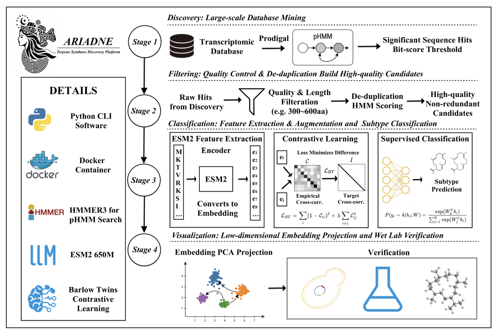

# Method

## Conceptual framing

Ariadne is organized around a simple biological and computational premise: the same curated reference collection should support candidate discovery, candidate interpretation, and final phylogenetic placement. In the current release, that shared reference backbone is the `tree/` directory.

This design is particularly useful for coral TPS mining and CeeSs prioritization, because it prevents the discovery stage, the classification stage, and the phylogeny stage from drifting apart in terms of biological context.

## Overview figure

<figure class="paper-figure">
  
  <figcaption>
    Figure 1. Ariadne uses a four-stage, tree-native workflow. The same <code>tree/</code> reference collection is reused across discovery, classification, and phylogeny.
  </figcaption>
</figure>

## Design principle: one reference backbone

The tree-native design has three direct consequences:

- the discovery query HMM and the classification feature space remain coupled to the same reference universe
- the final phylogeny is reconstructed against the same multi-clade background that informed screening
- output interpretation becomes easier, because nearest-neighbor assignments and phylogenetic placement can be compared within a consistent context

## Stage I. Discovery

The first stage focuses on sensitivity: Ariadne builds a discovery HMM from the default coral reference under `tree/` unless a prebuilt `--query-hmm` is explicitly supplied.

Two entry modes are supported:

- protein FASTA mode with `--protein-folder`
- transcriptome FASTA mode with `--transcriptomes`

In transcriptome mode, Ariadne first predicts ORFs with `pyrodigal`, then searches the translated proteins against the query HMM. In protein mode, the input proteins are searched directly.

Primary outputs:

- `candidates.protein.faa`
- `candidates.orf.fna`
- `candidates.hits.tsv`

These files define the candidate universe that will be refined downstream.

## Stage II. Filtering

The second stage focuses on candidate quality rather than biological interpretation.

It applies:

- coverage filtering (default ≥ 10×)
- minimum protein length filtering (default ≥ 300 aa)
- near-duplicate collapsing at 95% sequence identity

Reference-matched candidates (sequences with ≥95% identity to any reference in `tree/`) are **retained** in `candidates.filtered.faa`. Their reference matches are logged in `reference_matches.tsv` for downstream traceability — this allows novel alleles or species-specific variants of known coral TPS genes to proceed through classification and CeeSs scoring rather than being silently discarded.

This stage is deliberately conservative and transparent. Rather than hiding filtering decisions inside a monolithic score, Ariadne exports reports that make the reasons for representative selection and deduplication explicit.

Primary outputs:

- `candidates.filtered.faa`
- `filter_report.tsv`
- `dedupe_clusters.tsv`
- `reference_matches.tsv`
- `manual_review.tsv`

## Stage III. Classification

The third stage is the interpretive core of the workflow.

All filtered candidates and all reference sequences are scored against a TPS HMM library derived from `tree/`. Ariadne then constructs a joint feature space and performs:

1. feature-matrix construction
2. score normalization
3. low-dimensional embedding
4. nearest-reference voting

The result is not merely a label, but a structured evidence layer that includes embedding coordinates, nearest neighbors, local context trees, and a global context tree.

Primary outputs:

- `tps_features.tsv`
- `embedding.tsv`
- `classification.tsv`
- `nearest_neighbors.tsv`
- `candidate_cluster_context.tsv`
- `embedding.svg`
- `embedding_3d_sections.svg`
- `global_context_tree.nwk`

This stage is especially useful for CeeSs-oriented prioritization because it places candidate sequences inside the broader TPS landscape before phylogenetic reconstruction.

## Stage IV. Phylogeny

The fourth stage converts the screened candidate set into a phylogeny-ready analysis object.

Filtered candidates are merged with the reference sequences loaded from `tree/`, then processed with:

1. MAFFT for multiple sequence alignment
2. IQ-TREE for phylogenetic inference

This stage provides the bridge from candidate discovery to evolutionary interpretation.

Primary outputs:

- `phylogeny_input.fasta`
- `phylogeny_alignment.fasta`
- `phylogeny_sequence_map.tsv`
- `iqtree.treefile`
- `iqtree.iqtree`

## Why the current structure is effective

  

    <h3>Reference consistency</h3>
    
The same tree-native reference collection is reused across discovery, classification, and phylogeny, which improves interpretability.

  

  

    <h3>Screening-to-evolution continuity</h3>
    
Ariadne keeps nearest-neighbor evidence, embeddings, and phylogenetic outputs within one coherent result directory.

  

## Scope of the current release

The active release intentionally excludes:

- motif-centric post-filtering
- benchmark-versus-expected FASTA comparison

Those paths were removed so the current implementation remains focused on a stable and interpretable four-stage workflow.
