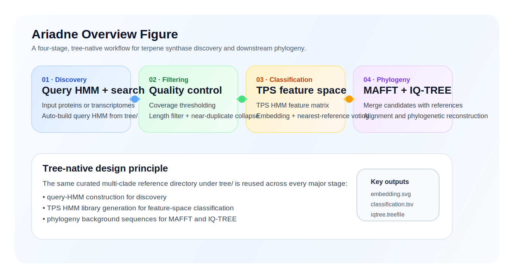

# Method

## Pipeline philosophy

Ariadne is built around a tree-native idea: the same curated multi-clade reference collection under `tree/` should guide candidate discovery, candidate interpretation, and final phylogenetic placement.

This reduces friction in practice:

- you do not need one reference source for HMM discovery and another for phylogeny
- the feature-space classifier and the final tree share the same biological background
- the outputs are easier to compare and curate manually

## Overview figure

<figure class="paper-figure">
  
  <figcaption>
    Figure 1. A four-stage workflow driven by a single multi-clade TPS reference directory.
  </figcaption>
</figure>

## Stage 1. Discovery

The discovery stage builds a query HMM from the coral reference FASTA under `tree/` unless a prebuilt `--query-hmm` is supplied.

It supports two input modes:

- protein FASTA discovery with `--protein-folder`
- transcriptome FASTA discovery with `--transcriptomes`

For transcriptome inputs, Ariadne predicts ORFs first and then searches the translated proteins with the discovery HMM.

Main outputs:

- `candidates.protein.faa`
- `candidates.orf.fna`
- `candidates.hits.tsv`

## Stage 2. Filtering

The filtering stage is intentionally simple and practical.

It applies:

- coverage filtering
- minimum protein length filtering
- near-duplicate collapsing

This stage is designed to clean the candidate pool before feature-space comparison and phylogenetic reconstruction.

Main outputs:

- `candidates.filtered.faa`
- `filter_report.tsv`
- `dedupe_clusters.tsv`
- `manual_review.tsv`

## Stage 3. Classification

Classification is performed in TPS HMM feature space.

The reference sequences and filtered candidates are all scored against a TPS HMM library. Ariadne then:

1. builds a feature matrix
2. normalizes the scores
3. embeds the joint reference-candidate set
4. assigns each candidate to the dominant source among its nearest reference neighbors

This is the stage that produces the most screening-friendly outputs.

Main outputs:

- `tps_features.tsv`
- `embedding.tsv`
- `classification.tsv`
- `nearest_neighbors.tsv`
- `embedding.svg`
- `embedding_3d_sections.svg`
- `global_context_tree.nwk`

## Stage 4. Phylogeny

The phylogeny stage merges the filtered candidates with the reference sequences loaded from `tree/`, then:

1. runs MAFFT on the combined FASTA
2. runs IQ-TREE on the alignment

This creates a direct bridge from candidate screening to phylogenetic interpretation.

Main outputs:

- `phylogeny_input.fasta`
- `phylogeny_alignment.fasta`
- `phylogeny_sequence_map.tsv`
- `iqtree.treefile`
- `iqtree.iqtree`

## Why this structure works well

  

    <h3>Unified reference logic</h3>
    
The same tree-native reference collection is reused across discovery, classification, and phylogeny.

  

  

    <h3>Fast manual inspection</h3>
    
The workflow exposes interpretable outputs such as embeddings, nearest-neighbor tables, and Newick trees.

  

## What the current release does not include

The current release intentionally does not include:

- motif-based post-filtering
- benchmark-vs-expected FASTA comparison

Those paths were removed to keep the active workflow compact and stable.
