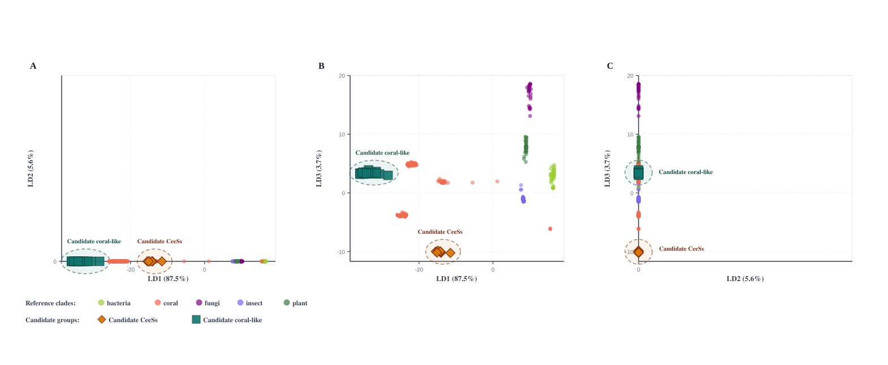

# Method

<p class="page-kicker"><span class="icon-mark"></span><span class="research-hero__eyebrow">Computational design</span></p>

## Conceptual Framing

Ariadne is organized as a sequential, evidence-preserving workflow for coral terpene synthase discovery. The article used this structure to move from a large TPS homolog set to a short CeeSs list that could be expressed in yeast. The design goal is not only to emit a final label, but to keep enough intermediate evidence for reruns, candidate auditing, manuscript reporting, and wet-lab selection.

<figure class="algorithm-figure" markdown="1">

<figcaption><strong>Figure 1.</strong> The documented Ariadne workflow follows four computational stages: discovery, filtering, classification, and visualization. Optional ESM2 CeeSs scoring is attached to the classification layer.</figcaption>
</figure>

<div class="method-caption" markdown>
The current main workflow is aligned with the README: users provide a reference FASTA directory with `--reference-dir`; Ariadne can build the needed HMM resources from those references when prebuilt profiles are not supplied; Stage IV is PCA/LDA visualization and candidate triage.
</div>

## Stage I - Discovery

The first stage constructs the candidate universe from either transcriptome assemblies or predicted protein FASTA files.

<div class="evidence-grid" markdown>

<div class="evidence-card" markdown>
### Transcriptome mode
`ariadne run --transcriptomes ...` predicts ORFs with Pyrodigal, translates candidate proteins, and screens them against the discovery HMM.
</div>

<div class="evidence-card" markdown>
### Protein mode
`ariadne run --protein-folder ...` searches user-provided protein FASTAs directly. This is the preferred route when protein prediction has already been performed.
</div>

</div>

Advanced sensitivity controls:

```bash
ariadne run \
  --protein-folder my_proteins/ \
  --reference-dir reference_fastas/ \
  --discovery-min-score 40 \
  --discovery-max-evalue 1e-5 \
  --output-dir results/
```

Primary outputs:

- `candidates.protein.faa` - protein candidates carried into filtering;
- `candidates.orf.fna` - nucleotide ORFs when transcriptome mode is used;
- `candidates.hits.tsv` - discovery hit table and search evidence.

## Stage II - Filtering

Filtering converts raw hits into a high-quality, non-redundant candidate set. The default filters are deliberately conservative:

| Control | Default | Purpose |
| --- | --- | --- |
| Coverage | `--min-coverage 10.0` | remove weakly supported transcript-derived records when coverage is present in headers |
| Length | `--min-length 300` | remove short fragments unlikely to represent complete TPS candidates |
| Deduplication | `--identity-threshold 0.95` | collapse near-identical candidates while preserving representative sequences |

Example tuning:

```bash
ariadne filter \
  --input-fasta candidates.protein.faa \
  --reference-dir reference_fastas/ \
  --min-coverage 8 \
  --min-length 300 \
  --identity-threshold 0.98 \
  --output-dir results/02_filtering/
```

Primary outputs:

- `candidates.filtered.faa` - filtered FASTA used for classification;
- `filter_report.tsv` - pass/fail evidence for each record;
- `dedupe_clusters.tsv` - near-duplicate membership;
- `reference_matches.tsv` - candidates that match known references;
- `manual_review.tsv` - records that deserve inspection.

## Stage III - Classification

The classification stage places filtered candidates and reference sequences into a shared TPS representation space. Ariadne then transfers labels from nearby references and writes the supporting evidence, rather than returning only a black-box prediction.

<div class="workflow-map" markdown>

<div class="workflow-step" markdown>
<span class="stage-label">Representation</span>
### Profile feature space
Reference and candidate sequences are scored against TPS profile features, normalized, and compared in the same matrix.
</div>

<div class="workflow-step" markdown>
<span class="stage-label">Evidence</span>
### Nearest references
`--top-k` controls how many neighbors are reported for each candidate. These neighbors provide the local support behind each assignment.
</div>

<div class="workflow-step" markdown>
<span class="stage-label">Optional</span>
### ESM2 CeeSs head
When `TPS.xlsx` and the `[esm]` dependencies are available, coral-like candidates are scored by an ESM2-based subtype classifier.
</div>

<div class="workflow-step" markdown>
<span class="stage-label">Advanced</span>
### Contrastive variant
`--ceess-classifier contrastive` uses the Barlow Twins representation path before the supervised CeeSs head.
</div>

</div>

Typical classification command:

```bash
ariadne classify \
  --candidates results/02_filtering/candidates.filtered.faa \
  --reference-dir reference_fastas/ \
  --ceess-xlsx TPS.xlsx \
  --output-dir results/03_classification/
```

Primary outputs:

- `tps_features.tsv` - feature matrix used for candidate comparison;
- `classification.tsv` - candidate assignments and CeeSs columns when enabled;
- `nearest_neighbors.tsv` - reference evidence for each candidate;
- `candidate_cluster_context.tsv` - local placement context;
- `assignment_summary.tsv` - aggregate assignment counts.

## Optional ESM2 CeeSs Scoring

The CeeSs layer trains on the root-level `TPS.xlsx` workbook. The workbook is expected to pair each labeled training sequence with its TPS type annotation:

| Column | Meaning |
| --- | --- |
| `Name` | record identifier |
| `Protein` | amino-acid sequence |
| `Type` | supervised TPS subtype label |
| `Species` | source organism |

Everyday use keeps the default MLP head:

```bash
ariadne classify \
  --candidates results/02_filtering/candidates.filtered.faa \
  --reference-dir reference_fastas/ \
  --ceess-xlsx TPS.xlsx \
  --ceess-classifier mlp \
  --ceess-threshold 0.9 \
  --output-dir results/03_classification/
```

For representation-learning experiments, switch to the contrastive path:

```bash
ariadne classify \
  --candidates results/02_filtering/candidates.filtered.faa \
  --reference-dir reference_fastas/ \
  --ceess-xlsx TPS.xlsx \
  --ceess-classifier contrastive \
  --ceess-barlow-redundancy-weight 0.005 \
  --ceess-threshold 0.9 \
  --output-dir results/03_classification_contrastive/
```

The full scoring design and output schema are documented in [CeeSs Classifier](esm-type.md).

## Stage IV - PCA/LDA Visualization

The fourth stage projects the same feature space for visual inspection. Ariadne prefers supervised LDA when labels support it and falls back to PCA when the supervised projection is not well defined.

The visualization layer is produced under `03_classification/`:

- `embedding.tsv` - projected coordinates and labels;
- `embedding_variance.tsv` - explained variance or projection metadata;
- `embedding.svg` - 2D visual inspection plot;
- `embedding_3d_sections.svg` - three orthogonal LDA/PCA panels (LD1–LD2, LD1–LD3, LD2–LD3);
- `ceess_embedding.svg` - optional ESM2 CeeSs projection when the ESM layer is enabled.

`embedding_3d_sections.svg` is the manuscript-style summary: reference clades are colored by source lineage, candidate CeeSs are orange diamonds, and candidate non-CeeSs are teal squares.

<figure class="paper-figure" markdown="1">

<figcaption><strong>Figure S2.</strong> LDA projection of coral TPS references and coral-like candidates in HMM-derived feature space. Reference clades are colored by source lineage (bacteria, coral, fungi, insect and plant). Candidate CeeSs and candidate non-CeeSs are shown as orange diamonds and teal squares, respectively. (A) LD1 versus LD2, (B) LD1 versus LD3 and (C) LD2 versus LD3.</figcaption>
</figure>

## Why This Structure Works

<div class="evidence-grid" markdown>

<div class="evidence-card" markdown>
### Stable candidate audit trail
Every stage emits TSV files that preserve the reason a sequence was kept, removed, assigned, or prioritized.
</div>

<div class="evidence-card" markdown>
### One reference directory
The same reference FASTA directory supports discovery HMM construction, candidate filtering, classification, and visualization.
</div>

<div class="evidence-card" markdown>
### Model-agnostic triage
Users can inspect profile-space assignments even when optional ESM2 dependencies are not installed.
</div>

<div class="evidence-card" markdown>
### Manuscript-ready outputs
SVG projections and tabular evidence can be archived with candidate FASTA files for transparent reporting.
</div>

</div>

## Scope Of The Current Release

The active release focuses on interpretable candidate discovery, quality control, profile-space classification, PCA/LDA visualization, and optional ESM2 CeeSs scoring.
